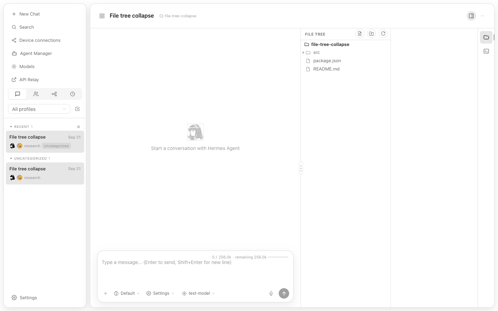
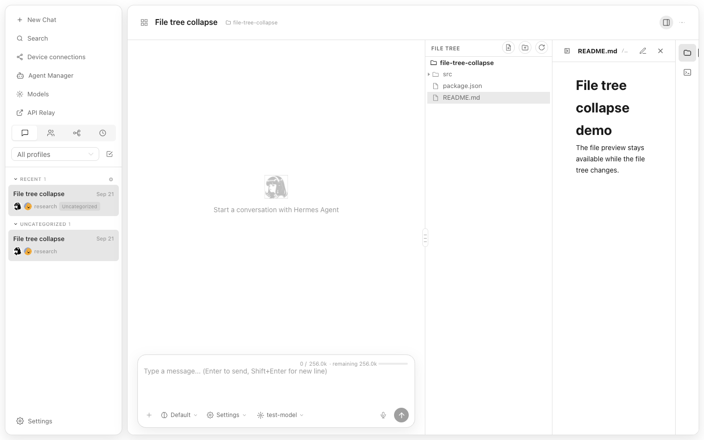
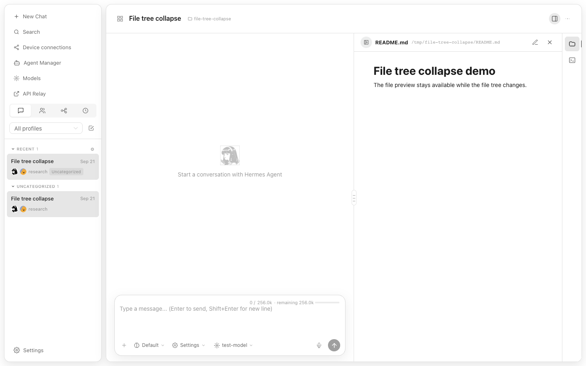

# File tree collapse visual evidence

These screenshots are generated by `tests/e2e/file-tree-collapse.spec.ts` with the mocked workspace fixture.

1. **Expanded tree** — the workspace file tree is visible.

   

2. **File opened** — `README.md` is open and the tree remains visible.

   

3. **Tree collapsed** — the preview remains open and the tree column no longer leaves a blank rail or gap.

   

4. **Tree restored** — the file tree returns without losing the open preview.

   
