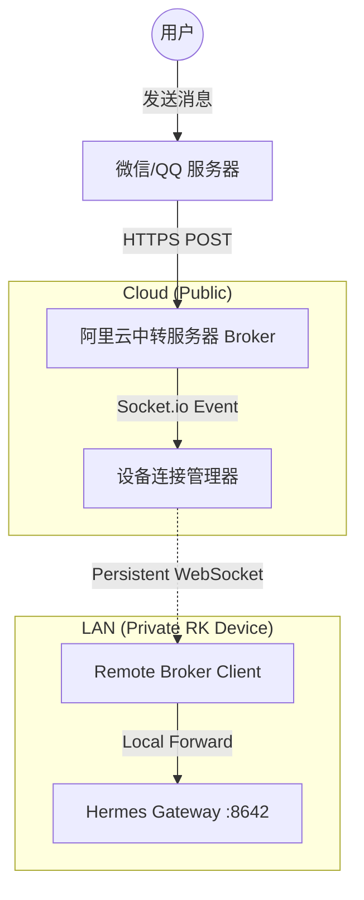

# 商业化改造计划：中转网关与大规模局域网设备集成 (2026-06-01)

## 1. 背景与目标
为了支持 1000+ 台 RK 硬件设备在局域网（无公网 IP、无 HTTPS）环境下的商业化部署，需将现有的 **Webhook (Push)** 消息接收模式改造为 **WebSocket (Pull)** 模式。

### 核心目标
- **用户零配置**：用户无需配置开发者后台或内网穿透。
- **开箱即用**：扫码授权后，消息自动通过云端中转站下发。
- **集中管理**：通过阿里云中转站统一管理 1000 台设备的状态。

## 2. 系统架构 (Commercial SaaS Architecture)

## 3. 详细方案

### Phase 1: 公网中转站 (Broker Server) 实现
- **技术栈**: Node.js + Express + Socket.io + Redis (用于存储设备在线状态)。
- **核心功能**:
    - **Webhook 路由**: `/webhook/:deviceId`，负责接收腾讯推送并解析。
    - **WebSocket 服务**: 维护与 1000 台设备的长连接，支持心跳检测。
    - **OAuth 代理**: 转发微信/QQ 的扫码登录请求，确保 Token 能正确下发。

### Phase 2: 边缘设备 (Edge Client) 改造
- **新增服务**: `packages/server/src/services/hermes/remote-broker-client.ts`。
- **逻辑流程**:
    1. 启动时根据 `DEVICE_ID` 连接公网 Broker。
    2. 监听 `webhook_event`。
    3. 收到事件后，使用 `axios` 将数据转发至本地网关 `http://127.0.0.1:8642/webhook`。
- **配置**: 增加 `WEBUI_BROKER_ENABLED` 和 `WEBUI_BROKER_URL` 环境变量。

### Phase 3: 商业化授权与扫码流程
- **托管模式**:
    1. 用户在 Web UI 点击“微信登录”。
    2. Web UI 向本地后端请求二维码，本地后端转发至阿里云 Broker。
    3. 阿里云 Broker 向腾讯请求二维码并返回。
    4. 用户扫码后，腾讯回调阿里云 Broker。
    5. 阿里云 Broker 保存 Token，并通过 WebSocket 将 Token 同步给对应的局域网设备。

## 4. 任务清单 (Todo List)

### 后端修改 (packages/server)
- [ ] 实现 `RemoteBrokerClient` 类，处理长连接与断线重连。
- [ ] 修改 `src/index.ts`，在初始化阶段注入远程连接逻辑。
- [ ] 增加设备唯一标识生成逻辑（UUID 或硬件序列号）。

### 前端修改 (packages/client)
- [ ] 在 `PlatformSettings.vue` 增加“远程模式”开关。
- [ ] 优化扫码登录反馈，支持从云端同步状态。

### 文档与部署
- [ ] 编写 `docs/broker-server-setup.md`（阿里云部署指南）。
- [ ] 更新 `README_zh.md` 中的商业化部署章节。

## 5. 安全考量
- **设备认证**: WebSocket 连接时需携带 Secret Key。
- **数据加密**: 所有通信必须基于 WSS (WebSocket Secure)。
- **隐私保护**: 中转站仅转发数据，不持久化聊天内容。

---
// [Cloud] 改造计划已就绪，等待执行。
