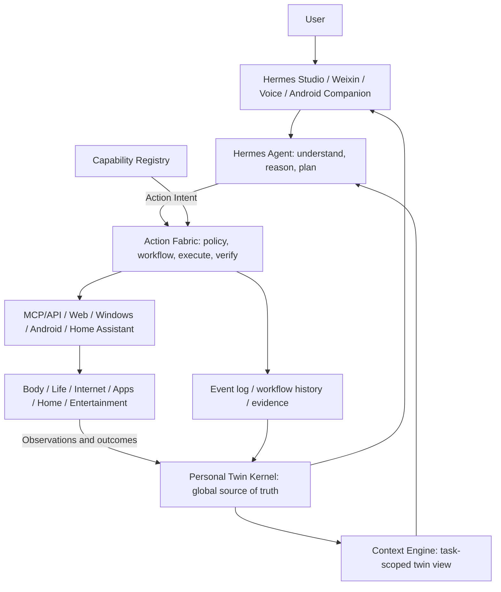
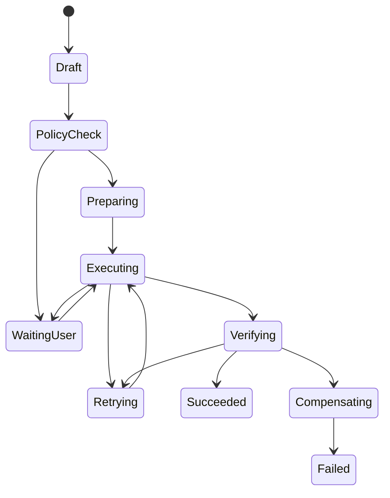
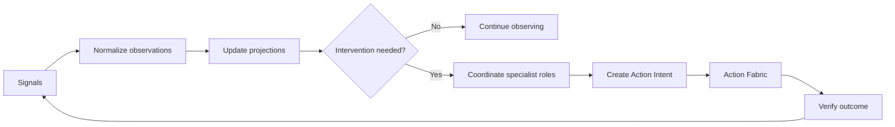

# Personal Digital Twin and Universal Action Fabric Design

Date: 2026-07-10
Owner: User + Codex
Status: Approved

## Executive Decision

Hermes Studio remains the primary framework for the personal operating system, but it must not become the sole implementation of every data source, protocol, and automation runtime.

The target architecture has four central responsibilities:

1. Hermes Studio is the user experience, administration, audit, and takeover surface.
2. Hermes Agent provides language understanding, reasoning, planning, role behavior, memory, and skills.
3. Personal Twin Kernel is the global source of truth for the user, goals, state, history, preferences, constraints, possessions, accounts, and environment.
4. Action Fabric turns semantic action intents into policy-checked, durable, verified operations across MCP, APIs, browsers, Windows, Android, Home Assistant, and future adapters.

The first deployment remains a Windows single-node modular monolith. A self-owned Android companion app is a paired execution node. The architecture must allow a later move to an always-on home server without changing domain contracts.

The selected autonomy model is budgeted autonomy:

- Actions inside explicit capability, target, time, and spending limits can execute automatically.
- The system should automate as much of a transaction as the platform permits.
- CAPTCHA, SMS challenge, fingerprint, face recognition, and other mandatory human verification move the workflow to a takeover state. They are not bypassed.
- Every side effect is durable, idempotent where possible, verified, and auditable.

## Goals

- Maintain one coherent digital twin of the user's body, life, home, digital activity, entertainment, purchases, and goals.
- Preserve deep domain systems for health, fitness, nutrition, skin, life planning, home, entertainment, and commerce.
- Let specialist assistants share facts while operating with different context and capability scopes.
- Support proactive sensing, state projection, cross-domain decisions, and next-best-action selection.
- Execute work on the internet and in applications, including MCP operations, browser workflows, Android apps, desktop apps, device control, food delivery, and shopping.
- Resume work after process or device failure without duplicating irreversible actions.
- Keep personal data local by default and minimize data exposed to models and external services.

## Non-Goals

- Replacing Hermes Agent or rewriting Hermes Studio from scratch.
- Making Home Assistant the personal operating system.
- Treating chat history or LLM memory as the source of truth.
- Letting an LLM directly own credentials, payment state, permission checks, or workflow retries.
- Introducing microservices, Kafka, Temporal, or a distributed database for the first Windows deployment.
- Building a perfect 3D body or home representation before the semantic and execution loops work.
- Bypassing platform security controls or anti-fraud challenges.

## Current Project Assessment

Hermes Studio is a strong interaction and orchestration foundation because it already has:

- Vue, Koa, Electron, desktop packaging, and a local runtime.
- Hermes Agent bridge integration and streamed tool execution.
- Profiles, models, skills, plugins, MCP management, Cron, messaging channels, and Weixin.
- A generic OpenAPI-backed Hermes Studio MCP surface.
- Local SQLite persistence and profile-aware paths.
- Personal State, Health State, Personal Autopilot, reminders, device discovery, and write approval patterns.
- Native Hermes Agent Home Assistant, browser, computer-use, and MCP capabilities.

The current Personal OS implementation is still an early vertical prototype:

- Health, Personal State, and reminders use separate profile-scoped SQLite databases.
- Personal Autopilot currently derives a small rule-based snapshot from Health and Personal State.
- Reminder dispatch is interval polling rather than a shared event-driven runtime.
- There is no global entity, relationship, observation, event, goal, or provenance contract.
- There is no general capability registry, durable action state machine, policy engine, verifier, or compensation model.
- Home digital twin design exists, but the runtime implementation is not yet a shared control plane.
- Hermes Profile currently risks becoming both a role definition and a physical data boundary.

Hermes Studio uses BSL 1.1 with a non-commercial grant and an Apache 2.0 change date of 2029-05-10. This is compatible with the current private non-commercial goal. Commercialization before the change date requires separate licensing review.

## Framework Alternatives

### Hermes-Only Monolith

Put every domain table, integration, rule, and UI workflow directly into Hermes Studio services.

Advantages:

- Fastest path for small features.
- One runtime and one language.

Disadvantages:

- Device, browser, mobile, and business semantics become tightly coupled.
- Domain databases and polling loops continue to fragment.
- Platform changes can destabilize unrelated Personal OS behavior.

This is acceptable for prototypes but not as the target architecture.

### Home Assistant or openHAB as the Main Framework

Model the entire personal system as entities, items, automations, and dashboards in a home automation platform.

Advantages:

- Mature device integrations, state tracking, events, and local automation.
- Strong physical-device abstraction.

Disadvantages:

- Body goals, medical records, long-term behavior, purchases, digital identities, media preferences, and multi-role reasoning do not fit naturally.
- Agent reasoning becomes an attachment to a home model.

Home Assistant should be a physical-control adapter, not the personal operating system.

### Hermes + Personal Twin Kernel + Action Fabric

Keep Hermes as the experience and cognition layer, add a global semantic twin, and execute all side effects through a durable capability fabric.

Advantages:

- One user model across physical and digital domains.
- Clear separation of reasoning, facts, policy, workflow, and platform drivers.
- MCP, Home Assistant, browser, desktop, and Android execution use the same action contract.
- Domains remain deep without becoming isolated.

Disadvantages:

- Requires careful contracts before feature expansion.
- More initial foundation work than direct tool calls.

This is the selected approach.

## Top-Level Architecture



### Responsibility Boundaries

Hermes Studio:

- Personal OS navigation and domain views.
- Current state, next action, and active workflow surfaces.
- Capability, policy, role, and adapter configuration.
- Audit, takeover, recovery, and emergency-stop controls.

Hermes Agent:

- Natural-language intent interpretation.
- Cross-domain reasoning and option selection.
- Specialist role behavior.
- Proposed plans, recommendations, and semantic action intents.
- Unknown-page interpretation when a deterministic driver cannot proceed.

Personal Twin Kernel:

- Canonical identities and relationships.
- Observed and derived state.
- Goals, preferences, constraints, plans, and events.
- Data provenance, confidence, and evidence.
- Domain projections and context queries.

Action Fabric:

- Capability discovery and executor routing.
- Authorization, limits, policy evaluation, and escalation.
- Durable workflow state, retries, leases, and recovery.
- Precondition and postcondition verification.
- Idempotency, compensation, and audit evidence.

Adapters:

- Provider-specific authentication and transport.
- Platform state reads and commands.
- Translation between provider payloads and semantic capability contracts.
- No ownership of long-term personal state.

## Global Twin Scope

There is one physical user and therefore one canonical personal twin. Hermes Profiles must not create separate copies of the user's body, home, purchases, or goals.

Recommended storage root:

```text
<HERMES_HOME>/personal/
  twin.db
  artifacts/
  backups/
```

The first implementation uses SQLite WAL. Artifacts such as body photos, reports, receipts, screenshots, and videos are stored as files addressed by content hash and referenced by database records. Secrets are stored separately in operating-system credential storage.

Existing profile-scoped databases remain available as migration sources until reconciliation and verification complete. Migration is idempotent and preserves source IDs.

## Twin Core Model

| Record | Purpose | Examples |
| --- | --- | --- |
| Entity | Stable identity for a physical or virtual object | user, body region, room, product, account, app, device, media item |
| Relation | Typed, time-aware connection between entities | arm belongs to body, scale located in bedroom, account owned by user |
| Observation | Time-stamped measured or reported value | weight, sleep duration, PM2.5, product price |
| Event | Immutable fact that occurred | meal eaten, workout completed, video watched, order created |
| Goal | Desired future state | target weight, posture improvement, budget, home order |
| Preference | Stable or inferred choice | taste, brand, media, music, address |
| Constraint | Boundary that must not be violated | allergy, budget, quiet hours, contact allowlist |
| StateProjection | Derived current state with rationale | recovery low, fat loss stalled, inventory low |
| Plan | Strategy for reaching goals | training week, meal plan, purchase plan |
| Recommendation | Specialist role proposal | recover today, train back, buy filter |
| ActionIntent | Semantic request for a real side effect | place order, send message, turn on purifier |
| Execution | Durable workflow instance and outcomes | order workflow, message send, device command |
| Artifact | Evidence file or external record | report, image, receipt, screenshot |

Every important record carries temporal and provenance metadata:

- Effective or occurrence time.
- Observation time and ingestion time.
- Source and source record ID.
- Actor and confirmation state.
- Confidence.
- Evidence or raw artifact reference.
- Schema and model version.

Measured facts, user reports, and model inferences remain distinguishable. An inference never silently replaces a measured fact.

## Profiles and Assistant Roles

The user's intended Profile model is valid when Profile represents a specialist assistant, not a separate user twin.

The conceptual layers are:

| Concept | Responsibility |
| --- | --- |
| Personal Twin | The one canonical user and life state |
| Assistant Role | Secretary, health manager, fitness coach, home manager, entertainment assistant |
| Hermes Profile | Model, provider, credentials, skills, tools, and runtime isolation |
| Session | A concrete conversation or task |

An Assistant Role defines:

```text
role_id
persona
context_scope
data_permissions
capability_permissions
spending_limits
decision_authority
memory_namespace
escalation_rules
```

A Hermes Profile may map one-to-one to a role initially. Strongly isolated roles, such as purchasing or finance, should use separate runtime credentials. Multiple roles may later share one runtime Profile when their security boundary is the same.

Roles write Recommendations into the shared twin. A chief-of-staff coordinator, implemented by Personal Autopilot, resolves conflicts against safety, commitments, long-term goals, current plans, and preferences.

Default priority order:

```text
safety and health hard constraints
committed real-world obligations
long-term goals
current plans
preferences and entertainment
```

## Domain Packs

Each deep Personal OS system is a first-party Domain Pack built over the shared twin. A Domain Pack contributes:

- Typed schema and migrations.
- Projectors and derived-state rules.
- APIs and detailed UI routes.
- Role context recipes.
- Semantic capabilities and policies.
- Event subscriptions and publications.
- Contract and domain tests.

Initial packs:

| Domain | Scope |
| --- | --- |
| Body and Health | body composition, measurements, posture, skin, sleep, exams, symptoms, recovery |
| Fitness and Nutrition | workouts, movements, load, meals, nutrients, supplements, adherence |
| Life and Work | calendar, tasks, habits, projects, contacts, communication, travel |
| Home and Assets | places, rooms, objects, inventory, devices, environment, maintenance |
| Entertainment | Bilibili, film, music, games, history, queues, leisure budget |
| Commerce | products, comparisons, carts, orders, payments, delivery, refunds, subscriptions |
| Digital Life | accounts, apps, files, devices, notifications, and network services |

Domain Packs do not get separate copies of shared facts. One food-delivery order can simultaneously produce nutrition, commerce, schedule, location, and health events.

The Personal OS global surfaces are:

- Now: inferred state and one next-best action.
- Twin: body, life, space, possessions, accounts, and relationships.
- Action Center: running, waiting, failed, recoverable, and reversible actions.
- Timeline: cross-domain life events.
- Goals and Strategy: long-term goals and current policy.
- Capabilities and Authorization: adapters, limits, role access, and health.

Domain pages remain deep systems. The global surface coordinates them rather than replacing them.

## Capability Registry

Every executable capability has a semantic contract independent of provider implementation.

Required fields include:

```text
capability_id
domain and verb
input and output schema
executor type and node
authentication requirements
side-effect and risk classification
role and target restrictions
idempotency support
reversibility or compensation support
verification strategy
availability and health
cost and spending metadata
```

Example semantic capabilities:

- `bilibili.video.search`
- `bilibili.video.publish`
- `food_delivery.order.place`
- `commerce.order.cancel`
- `messaging.message.send`
- `home.air_purifier.set_power`
- `desktop.application.launch`

Raw click, tap, and keyboard primitives are driver-level capabilities. They are not the preferred top-level contract for specialist roles.

Executor preference order:

```text
official API
MCP
stable browser DOM
Android accessibility
vision and coordinate automation
```

Changing executor does not change action semantics and must trigger a fresh policy check when risk changes.

## Action Intent

Agents submit structured intent instead of invoking provider-specific operations directly.

```json
{
  "action": "food_delivery.order.place",
  "goal": "Fill today's protein gap while controlling calories",
  "constraints": {
    "max_amount": 80,
    "delivery_before": "20:00",
    "exclude": ["user-allergens"]
  },
  "requested_by": "nutrition_coach"
}
```

The Action Fabric resolves entities, chooses a capability and executor, evaluates policy, persists the workflow, performs steps, verifies the result, and records outcomes back into the twin.

## Durable Workflow Model



The first runtime uses an embedded SQLite workflow queue with:

- Atomic step and event persistence.
- Worker leases and crash recovery.
- Transactional outbox delivery.
- Idempotency keys.
- Retry limits and exponential backoff.
- Circuit breakers and dead-letter state.
- Preconditions, postconditions, and evidence.
- Compensation intents for cancel, refund, or reversal where available.

Hermes Cron remains useful for scheduled triggers. It is not the source of truth for a multi-step transaction.

## Budgeted Autonomy Policy

Policy checks include:

- Requesting role.
- Data access scope.
- Capability and account authorization.
- Target allowlist.
- Per-action and daily spending limits.
- Time and location window.
- Current confidence and evidence quality.
- Executor and device health.
- Current price, address, recipient, and other transaction details.
- Human-verification requirements.

Mandatory platform security challenges move the workflow to `WaitingUser`. A price, target, or material input change triggers a fresh policy evaluation.

## Transaction Safety

Irreversible and financial workflows require:

- A unique intent and idempotency key.
- A pre-execution snapshot.
- Quote or review before commit where the platform supports it.
- Result verification using an order ID, message ID, receipt, or observed device state.
- State lookup before any retry after an uncertain response.
- A bounded retry policy.
- Cancellation, refund, or reverse-action support when possible.

For example, after a payment connection failure the workflow queries order state first. It retries payment only when the platform confirms that payment did not complete. Unknown state requires takeover and never blind resubmission.

## Event-Driven Autonomy Loop



Triggers include observations, state thresholds, scheduled windows, cross-domain conflicts, external notifications, and execution outcomes.

Deterministic code owns:

- Units, calculations, trends, and reference comparisons.
- Permission and spending limits.
- Order, payment, retry, and workflow state.
- Idempotency, scheduling, and device state.

Agent reasoning owns:

- Natural-language intent.
- Cross-domain synthesis.
- Trade-off selection among valid options.
- Plans and explanations.
- Unknown user-interface interpretation.
- Proposed preferences and behavioral patterns.

## Memory Separation

The system recognizes three memory classes:

1. Twin Facts are provenance-aware facts and derived state. They are the only authoritative personal state.
2. Episodic Memory stores conversations and events for recall but is not automatically factual.
3. Skills store procedures for completing work, such as shopping or report processing.

Hermes Memory and Skills continue to serve the second and third classes. Context Engine retrieves only the Twin data, episodes, and procedures required for the current role and task.

## Windows and Android Deployment

Initial topology:

```text
Windows main node
  Hermes Studio server and desktop UI
  Hermes Agent bridge and gateway
  Personal Twin Kernel
  Action Fabric worker
  Browser and desktop adapters
  SQLite and artifact storage

Xiaomi Android phone
  Self-owned Hermes Companion
  Device identity and encrypted pairing
  Accessibility execution
  Notification observation
  Screen capture with explicit permission
  Location and app capability reporting
  Takeover UI

Optional external runtimes
  Home Assistant
  MCP servers
```

The Windows background service must continue running when the Electron window is closed. Future migration can move server-side components to a home server while retaining the same APIs, role model, and capability contracts.

## Security

- Windows credentials use operating-system secure storage.
- Android credentials and private keys use Android Keystore.
- Paired nodes have independent device identities, signed requests, encrypted transport, replay protection, and revocation.
- Browser sessions are isolated and encrypted at rest where practical.
- Credentials and raw session secrets are never included in LLM prompts or normal audit logs.
- Health data receives stricter context and outbound-sharing scopes.
- Adapter outputs are minimized and redacted before entering model context.
- Roles receive least-privilege data and capability scopes.

Emergency stop has three levels:

1. Pause creation of new actions.
2. Stop all interruptible active workflows.
3. Revoke executor tokens and disable all external write capabilities.

Controls are available in Studio, the Android companion, and a restricted messaging command.

## Error Handling

- Temporary network failure: bounded exponential-backoff retry.
- Repeated connector failure: circuit breaker and visible degraded status.
- Stale observation: exclude from sensitive decisions or lower confidence.
- MCP failure: use another executor only after capability and policy re-evaluation.
- Browser or app layout change: stop, preserve evidence, and request repair or takeover.
- CAPTCHA or biometric challenge: `WaitingUser` with a direct takeover route.
- Price, address, target, or recipient change: invalidate the policy decision and re-check.
- Unknown transaction outcome: query provider state and prohibit blind repeat.
- Failed compensation: create an explicit manual-resolution item.
- Missing external system: keep the twin usable and mark that control domain unavailable.

## Audit Model

Every side effect records:

- Initiating user, role, trigger, and rationale.
- Input twin facts and versions.
- Policy decision and limit usage.
- Workflow and executor steps.
- Timestamps and node identity.
- API receipts, screenshots, order IDs, message IDs, or resulting device states.
- Cost and spending impact.
- Retry, failure, compensation, and takeover history.

Audit records are append-only and hash chained so ordinary UI operations cannot silently rewrite history.

## Testing and Staged Autonomy

Capability rollout stages:

```text
simulator and fixture tests
observe only
plan without execution
sandbox or test account
low-limit real execution
measured stability
higher policy limits
```

Required test layers:

- Twin schema, temporal, provenance, and projector tests.
- Role context and data-permission tests.
- Policy boundary and cumulative-limit tests.
- Workflow transition, lease, restart, retry, and idempotency tests.
- Adapter contract tests using recorded and synthetic fixtures.
- Virtual Home Assistant and virtual commerce providers.
- Browser and Android UI snapshot tests.
- Historical event replay tests.
- End-to-end shadow-mode comparisons.
- Emergency-stop and credential-revocation tests.

Real payment is enabled only after simulated, shadow, and low-limit execution pass agreed stability checks.

## Migration and Delivery Sequence

### Phase 0: Protect Current State

- Back up current Health State, Personal State, reminders, Hermes Profiles, and credentials.
- Inventory existing records, APIs, and migration provenance.
- Keep existing pages and databases operational.

### Phase 1: Personal Twin Foundation

- Create the global Twin database and migration framework.
- Add entities, relations, observations, events, goals, preferences, constraints, artifacts, projections, and outbox.
- Add compatibility readers and idempotent importers for current Personal OS databases.

### Phase 2: Roles and Context Engine

- Add Assistant Role definitions and Profile mappings.
- Add data and capability scopes.
- Build role-specific context recipes over the shared twin.

### Phase 3: Action Fabric Foundation

- Add Capability Registry, policy engine, durable workflow runtime, audit, and emergency stop.
- Start with simulator adapters and reversible internal actions.

### Phase 4: Health Closed Loop

- Project S400, body measurements, posture, skin, diet, fitness, sleep, and internal-health records into the twin.
- Drive next action and Weixin reminders from event-derived state.
- Record completion and adjust strategy.

### Phase 5: Home Closed Loop

- Subscribe to Home Assistant events rather than relying only on polling.
- Model rooms, objects, inventory, devices, capabilities, state, and bindings.
- Execute safe controls and verify resulting state.

### Phase 6: Internet Execution Proof

- Add a generic MCP executor and register Bilibili MCP capabilities.
- Add a persistent browser executor.
- Prove a semantic internet action can run, resume, verify, and audit.

### Phase 7: Android Companion

- Implement encrypted pairing, capability reporting, accessibility execution, notification observation, screen capture, and takeover.
- Register supported apps as semantic capabilities rather than exposing only raw UI primitives.

### Phase 8: Commerce Autonomy

- Implement search, compare, cart, quote, order, payment, delivery, cancel, and refund workflows.
- Start with food delivery and Taobao in observe and shadow modes.
- Enable low-limit real execution before raising limits.

### Phase 9: Life and Entertainment Expansion

- Integrate calendar, contacts, travel, Bilibili, music, games, subscriptions, and leisure planning.
- Let health, commitments, budget, and preferences constrain entertainment automation.

## Acceptance Criteria

- All assistant roles read one canonical user twin.
- Existing health data migrates with source identity and without destructive overwrite.
- One S400 reading creates one observation and updates all relevant projections exactly once.
- A health signal can change today's recommendation and create an auditable reminder.
- A Home Assistant state event can trigger a safe command and verify the resulting state.
- A Bilibili MCP action executes through Capability Registry and appears in the shared audit trail.
- A workflow resumes from verified state after a Windows restart.
- Uncertain order or payment results cannot produce blind duplicate submission.
- Android takeover resumes the same durable workflow rather than starting an unrelated task.
- Every automatic action can explain why it ran, which facts and policy were used, and what changed.
- Emergency stop prevents new external writes and revokes configured executors.

## External Architecture References

- Home Assistant core architecture: https://developers.home-assistant.io/docs/architecture/core/
- Home Assistant WebSocket API: https://developers.home-assistant.io/docs/api/websocket/
- Hermes Agent built-in tools: https://hermes-agent.nousresearch.com/docs/reference/tools-reference/
- Hermes Agent toolsets: https://hermes-agent.nousresearch.com/docs/reference/toolsets-reference
- Hermes Agent MCP: https://hermes-agent.nousresearch.com/docs/user-guide/features/mcp/
- openHAB semantic model: https://www.openhab.org/docs/tutorial/model.html
- Eclipse Ditto digital twins: https://eclipse.dev/ditto/intro-digitaltwins.html
