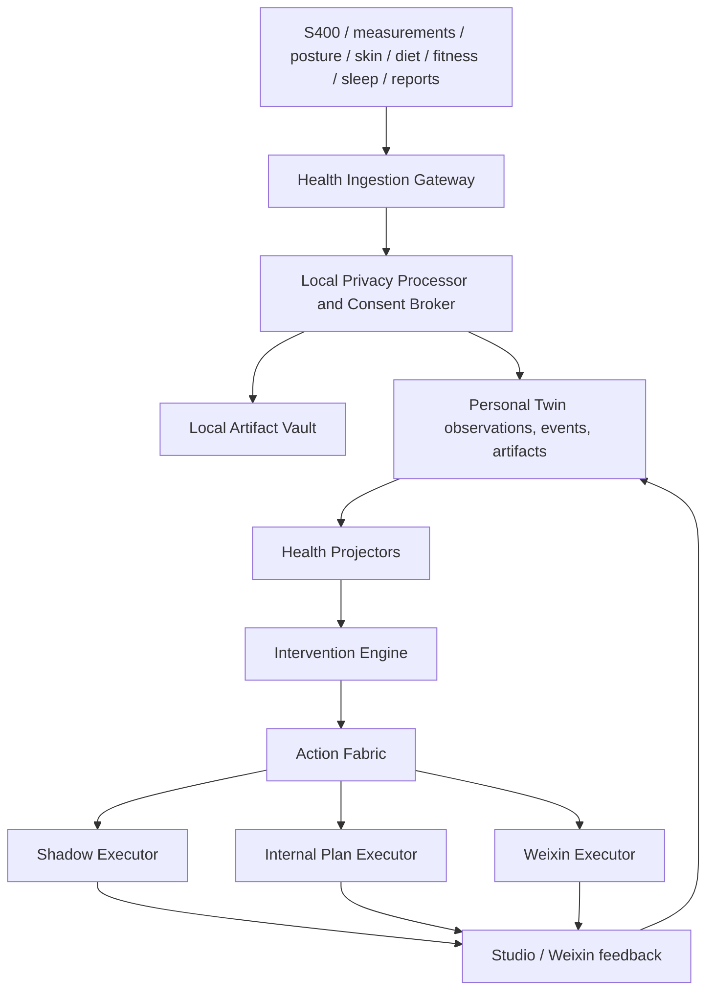

# Health Closed-Loop Kernel Design

Date: 2026-07-13
Owner: User + Codex
Status: Approved
Roadmap phase: Phase 4

## Decision

Implement Phase 4 as a Health Closed-Loop Kernel inside the existing Hermes Studio modular monolith.

Personal Twin remains the canonical source of health facts and derived state. Action Fabric remains the only path for side effects, including plan changes, remote artifact processing, Studio prompts, and Weixin reminders. Existing `health_state.db`, Personal Autopilot, reminder, S400, Body3D, Fitness, and settings work is preserved as migration input and compatibility UI while Phase 4 moves authoritative decisions to the shared Twin and Fabric contracts.

Phase 4 covers all eight health domains:

1. S400 body composition.
2. Body measurements.
3. Posture.
4. Skin.
5. Diet.
6. Fitness.
7. Sleep.
8. Internal health and checkup records.

All eight domains receive automatic ingestion and intervention paths. Missing provider APIs do not justify invented sensor data. Guided capture, structured imports, local OCR or vision processing, and explicitly authorized remote processing are valid ingestion modes when a direct connector is unavailable.

## Goals

- Normalize all eight health domains into one provenance-aware Personal Twin.
- Preserve measured, reported, inferred, and derived data as distinct evidence classes.
- Derive deterministic health projections from immutable observations and events.
- Select one explainable next-best health action while retaining alternatives.
- Execute low-risk lifestyle changes and reminders through Action Fabric.
- Require confirmation for medical, supplement-dose, pain, and abnormal-marker decisions.
- Start outbound Weixin delivery in shadow mode and require an explicit switch for real sending.
- Record completion, partial completion, deferral, rejection, adverse feedback, and correction.
- Recompute strategy after every relevant input or outcome.
- Keep raw health artifacts local by default and require one-time authorization for remote processing.

## Non-Goals

- Medical diagnosis, emergency triage replacement, or clinician substitution.
- Automatic medication or supplement-dose changes.
- Claiming camera-estimated measurements are equivalent to physical measurements.
- Sending raw health artifacts to normal chat context.
- Replacing Hermes Agent, Personal Twin, Action Fabric, or the existing Health UI.
- Introducing a separate health microservice for the initial Windows deployment.
- Enabling real Weixin delivery by default.

## Alternatives Considered

### Extend Health State and Personal Autopilot Directly

This is the shortest implementation path, but it retains multiple profile-scoped sources of truth, direct reminder side effects, polling-centric decisions, and a second policy system outside Action Fabric. It is rejected as the target architecture.

### Separate Health Service

A separate service gives strong isolation, but it adds deployment, authentication, transaction, and recovery boundaries that are unnecessary for the current single-node modular monolith. It is deferred until scale or independent deployment justifies it.

### Health Closed-Loop Kernel

The selected approach adds health-specific ingestion, projection, intervention, and outcome modules while reusing Personal Twin, Assistant Roles, Action Fabric, audit, and emergency control. It requires more migration work but preserves the architecture established in Phases 1-3.

## Top-Level Architecture

## Responsibility Boundaries

### Health Ingestion Gateway

- Own source discovery, connector state, normalization, validation, deduplication, and source identity.
- Convert provider payloads into health-domain observations and events.
- Never decide clinical significance or perform side effects.
- Never persist provider credentials in Twin, artifacts, workflow input, or audit.

### Privacy Processor and Consent Broker

- Store raw photos, videos, reports, and exports in the local Artifact Vault.
- Prefer local parsers, OCR, and vision models.
- Produce a manifest before any remote processing: artifact, selected pages or regions, purpose, processor, fields requested, and retention statement.
- Mint a single-use authorization bound to the manifest digest.
- Reject changed, expired, replayed, or broader remote-processing requests.

### Personal Twin

- Own normalized observations, immutable events, artifacts, goals, constraints, preferences, and projections.
- Preserve source, source record ID, effective time, ingestion time, confidence, evidence class, parser or model version, and confirmation state.
- Keep measured data separate from reported, inferred, and derived data.

### Health Projectors

- Deterministically derive current domain state from Twin records.
- Record input record IDs, versions, rule version, freshness, confidence, conflicts, and rationale.
- Produce no side effects.

### Intervention Engine

- Evaluate domain rules, cross-domain conflicts, risk, timing, cooldowns, and user burden.
- Produce recommendations and semantic Action Intents.
- Never send a message or directly mutate a plan.

### Action Fabric

- Resolve capabilities and executors.
- Enforce role, data, target, privacy, risk, approval, time, and frequency policies.
- Persist prepare, execute, verify, retry, compensation, and audit state.
- Apply emergency-stop controls to health actions.

## Evidence Classes

Every health value uses one of these classes:

| Class | Meaning | Example |
| --- | --- | --- |
| `measured` | Produced by a device, physical measurement, or lab | S400 weight, tape waist, lab glucose |
| `reported` | Explicitly entered or confirmed by the user | Pain score, meal portion confirmation |
| `inferred` | Estimated by a parser or model | Photo-estimated posture angle |
| `derived` | Deterministic computation from other Twin facts | Seven-day weight trend |

Precedence is not a destructive overwrite rule. A newer inferred value may be displayed as current when appropriate, but it never replaces or relabels a measured value. Conflicts remain explicit.

## Eight-Domain Ingestion

### S400 Body Composition

Supported inputs:

- Existing S400 or Xiaomi sync adapter.
- SmartScaleConnect webhook or export.
- Home Assistant event when available.
- Normalized JSON, CSV, or confirmed manual entry.

Normalize weight, BMI, body fat, body water, fat mass, bone salt, protein, muscle, skeletal muscle, visceral fat, basal metabolism, waist-hip ratio, body age, lean mass, device model, and measurement time. Unknown provider fields are preserved only in a local raw artifact and are not guessed into canonical metrics.

One source reading produces one immutable observation set and one stable source identity. Re-importing the same reading is a no-op. A changed payload under the same identity is a source conflict.

### Body Measurements

Supported inputs:

- Guided tape measurement.
- Structured device or CSV import.
- Standardized photos with an approved scale reference.
- Future smart-tape connectors.

Store left and right measurements separately. Camera estimates carry calibration method, capture conditions, model version, and confidence. Physical measurements and estimates coexist.

### Posture

Supported inputs:

- Guided front, side, and back photos.
- Guided short video.
- Structured clinician or trainer assessment.

Local landmark processing is preferred. Store landmarks or derived angles only when allowed by artifact policy. Projections include head, shoulder, scapular, thoracic, lumbar, pelvic, knee, and left-right asymmetry findings with confidence. These are tracking signals, not diagnoses.

### Skin

Supported inputs:

- Standardized periodic photos by body region.
- Confirmed user reports.
- Future dermatology-report imports.

Capture region, lighting profile, distance, device, and comparison baseline. Project appearance trends such as visible acne, marks, redness, dryness, or pigmentation without inferring a medical cause. Low-confidence changes request recapture instead of intervention.

### Diet

Supported inputs:

- Existing food logs, items, templates, and supplement records.
- Text quick logs and Weixin replies.
- Meal photos.
- Receipts or structured exports.

Use the existing local food database before external lookup. Persist food, portion, meal time, macro and micronutrients, water, parser confidence, and confirmation status. When portion uncertainty materially changes the decision, request one short confirmation.

### Fitness

Supported inputs:

- Existing workout logs.
- Mi Fitness or device exports.
- Android Companion or wearable events when available.
- Quick logs and completion feedback.

Normalize exercises, sets, repetitions, load, duration, intensity, muscle groups, pain, perceived exertion, and completion. Derived training load remains traceable to source events.

### Sleep

Supported inputs:

- Mi Fitness or wearable exports.
- Android Companion when implemented.
- Home Assistant sleep or presence signals where configured.
- User-reported sleep and recovery.

Normalize sleep window, duration, interruptions, stages when supplied, resting indicators, freshness, and subjective recovery. Missing stages are omitted rather than estimated from duration.

### Internal Health

Supported inputs:

- PDF, image, CSV, or structured hospital exports.
- Existing health records.
- Confirmed manual markers.

Local OCR and structured parsing run first. Normalize marker key, display label, value, unit, reference interval, provider abnormal flag, measured time, institution, report, and page or region evidence. First-time parsed results remain `pending_confirmation` before participating in high-risk decisions.

## Connector State

Every connector exposes:

- Configuration and authorization state without returning secrets.
- Last successful sync and last attempted sync.
- Cursor or watermark.
- Health: healthy, degraded, unhealthy, or unavailable.
- Data freshness by domain.
- Last sanitized error code.
- Supported read and write capabilities.

Connector failure does not make existing Twin state unavailable. It marks affected projections stale and prevents sensitive automatic decisions when freshness policy is not satisfied.

## Health Projections

Phase 4 defines these versioned projections:

- `health.body_composition_state`
- `health.fat_loss_state`
- `health.nutrition_state`
- `health.training_state`
- `health.recovery_state`
- `health.posture_state`
- `health.skin_state`
- `health.internal_state`
- `health.readiness_state`

Each projection contains:

- Current structured state.
- Input Twin record IDs and versions.
- Effective and computed times.
- Freshness and confidence.
- Conflicts and missing information.
- Rule set and schema version.
- Human-readable rationale safe for authorized roles.

Projectors are deterministic and replayable. Historical replay with the same inputs and rule version produces the same projection payload.

## Intervention Engine

The engine evaluates:

1. Freshness and confidence gates.
2. Single-domain rules.
3. Cross-domain conflict rules.
4. Risk and approval rules.
5. User preferences, constraints, goals, and current plan.
6. Time windows, cooldowns, frequency budgets, and recent outcomes.
7. Candidate ranking.

Candidates are ranked by urgency, expected benefit, confidence, goal relevance, execution burden, timing, and recent reminder history. The engine chooses one primary action and may keep ranked alternatives for the Studio UI.

Important cross-domain rules include:

- Poor sleep, material pain, or low recovery overrides high-intensity training.
- Excessive weight-loss velocity plus reduced energy or performance reduces the planned deficit.
- Protein shortage on a resistance-training day prioritizes nutrition over additional training.
- Training load concentrated on a constrained posture chain triggers correction or recovery.
- Skin deterioration produces lifestyle, capture-quality, or follow-up actions, not causal diagnosis.
- Internal markers require units, reference intervals, date, and source before high-risk interpretation.
- High-risk signals cannot be suppressed by weight, appearance, or performance goals.

## Risk and Decision Authority

### Low Risk

May execute automatically within role and policy limits:

- Adjust a daily diet target within configured bounds.
- Reduce or rearrange training intensity.
- Add recovery, sleep, skincare, hydration, or measurement reminders.
- Schedule a repeat capture or check-in.
- Update reversible lifestyle plan fields.

### Medium Risk

May prepare automatically but requires approval or explicit confirmation:

- Material weekly plan changes.
- Remote processing of a health artifact.
- Sharing a health-derived summary through an external channel beyond the configured self-recipient.
- Recommendations responding to persistent pain or repeated abnormal trends.

### High or Critical Risk

Never receives an automatic execution capability in Phase 4:

- Medication changes.
- Supplement-dose changes.
- Diagnosis or treatment of abnormal laboratory findings.
- Emergency disposition decisions.

The system provides a clear warning, requests review, and recommends appropriate professional or emergency help without presenting itself as a clinician.

## Action Fabric Capabilities

Register versioned capabilities:

- `health.source.sync`
- `health.artifact.analyze.local`
- `health.artifact.analyze.remote`
- `health.plan.adjust`
- `health.plan.restore`
- `health.reminder.send`
- `health.checkin.request`
- `health.followup.schedule`

`health.plan.adjust` is reversible and records the previous plan version. `health.plan.restore` performs compensation with compare-and-set protection so it cannot overwrite a later user change.

Remote artifact analysis requires a single-use consent token bound to the exact artifact manifest and processor. Reminder capabilities restrict the target to the configured self-recipient in Phase 4.

## Executors

Action Fabric adds a connector-capable executor class with explicit `externalWrite` classification. Initial adapters are:

- Health shadow executor.
- Internal health-plan executor.
- Local artifact-analysis executor.
- Authorized remote artifact-analysis executor.
- Weixin self-reminder executor.

The shadow executor performs prepare and verify without the external side effect. It records the message or plan change that would have occurred and all policy decisions.

The Weixin executor obtains a provider receipt or message identity when available. An uncertain send result is queried before retry. Blind duplicate sends are prohibited.

## Reminder Policy

- Default to shadow mode.
- Require an explicit super-admin switch for real delivery.
- Send at most one primary health action at a time.
- Enforce quiet hours, daily limits, category cooldowns, stable deduplication, and recipient restrictions.
- Do not resend when new data does not materially change the recommendation.
- Allow a new high-priority recovery or safety signal to supersede a lower-priority reminder.
- Include only the minimum health detail required to act.
- Attach a stable action identifier and completion route.

## Outcome Feedback

Accepted outcomes are:

- Completed.
- Partially completed.
- Skipped.
- Deferred.
- Adverse feedback or pain.
- Recommendation unsuitable.
- Source data incorrect.
- Expired without response.

Studio and Weixin feedback create immutable Twin events. The outcome projector updates adherence, cooldown, current plan state, and strategy inputs. Repeated skips may reduce frequency or change the proposed action, but never relax medical safety policy.

## UI Design

### Health Command Center

Evolve the existing Health view rather than replacing it. The primary layout contains:

- Current readiness and one next action.
- Eight-domain freshness and connector status.
- Body3D and selected-region evidence.
- Active intervention workflow and shadow or live state.
- Data conflicts, confirmation requests, and privacy authorizations.
- Recent outcomes and strategy changes.

Existing S400, Body3D, diet, fitness, skin, and internal-health surfaces remain available as domain drill-downs.

### Capture and Import

Add guided capture flows for measurements, posture, skin, diet, and reports. Each flow displays capture requirements, local or remote processing mode, extracted values, confidence, and required confirmations.

### Automation Controls

Add controls for:

- Global health automation state.
- Shadow or live delivery.
- Quiet hours and daily limits.
- Domain-level ingestion and intervention enablement.
- Connector health and resync.
- Remote-processing consent history and revocation.
- Risk approvals and pending takeovers.

The UI consumes server-provided available actions and does not infer workflow transitions locally.

## Compatibility and Migration

The existing dirty-worktree health changes are an approved Phase 4 baseline and must be preserved. Implementation starts with a scoped audit and focused tests before modifying them.

Migration rules:

- Keep `health_state.db` readable during Phase 4.
- Reuse the Phase 1 idempotent legacy import patterns.
- Convert existing S400 readings, body profile, posture, skin, diet, fitness, sleep, internal markers, plans, and check-ins to Twin records with stable source IDs.
- Do not destructively delete or rewrite source databases.
- During transition, Health UI may use a compatibility read model assembled from Twin plus legacy fields not yet migrated.
- New closed-loop decisions use Twin projections only.
- Retire the direct reminder scheduler only after shadow parity and migration verification.

## Error Handling

- Connector unavailable: keep prior state, mark stale, and block freshness-sensitive intervention.
- Invalid provider payload: quarantine the record with a sanitized reason; do not partially commit a reading.
- Duplicate source identity with different content: create a conflict and require reconciliation.
- Local parser failure: preserve the artifact and allow retry after parser upgrade.
- Remote consent missing or changed: stop before upload and request a new authorization.
- OCR or vision low confidence: request recapture or confirmation.
- Projection failure: retain prior projection, expose degraded state, and make the failed input replayable.
- Policy denial: preserve the recommendation and explanation without creating the side effect.
- Weixin failure: bounded retry when confirmed safe; unknown state requires provider lookup or takeover.
- Plan compensation conflict: do not overwrite a newer plan; create a manual-resolution item.
- Emergency stop: apply Action Fabric Level 1-3 semantics to new intents, active work, remote uploads, and external messages.

Errors returned through HTTP or shown in the UI use stable sanitized codes. Raw provider, SQLite, filesystem, credential, and parser errors remain out of normal responses and audit payloads.

## Security and Privacy

- Store raw health artifacts under the Personal Twin artifact root using content addressing.
- Encrypt sensitive local artifacts where platform support permits.
- Keep credentials in existing OS or profile credential storage, never Twin or Action Fabric payloads.
- Restrict health context to authorized Assistant Roles and task-specific recipes.
- Do not put raw photos, reports, or full marker collections in ordinary prompts.
- Record artifact access and outbound disclosure decisions.
- Redact message previews and audit evidence that could expose credentials or unnecessary health detail.
- Bind real Weixin delivery to the configured self-recipient in Phase 4.

## Testing Strategy

### Unit and Contract Tests

- Connector normalization, units, timestamps, cursors, and source identity.
- Artifact manifests, consent tokens, replay rejection, and scope binding.
- Measured, reported, inferred, and derived evidence separation.
- Projector determinism, freshness, confidence, and conflict handling.
- Domain rules and cross-domain overrides.
- Risk classification and approval boundaries.
- Capability contracts and executor binding.
- Idempotency, retries, compensation, and unknown-result handling.
- Reminder quiet hours, limits, supersession, and stable deduplication.
- Outcome events and strategy recomputation.

### Integration Tests

- One S400 reading updates all expected projections exactly once.
- A diet, training, sleep, posture, skin, measurement, or internal-health input can change the next action.
- A recommendation creates an Action Fabric intent and shadow workflow.
- Enabling live mode sends through the Weixin executor and records verification evidence.
- Completion feedback updates Twin and changes or clears the next action.
- Remote artifact analysis cannot run without a valid one-time consent.
- Restart resumes eligible workflows without duplicate external effects.
- Emergency stop blocks or interrupts the correct health actions.

### UI and End-to-End Tests

- Eight-domain freshness and connector status.
- Guided capture, extracted-value review, and confirmation.
- Body3D and domain drill-down continuity.
- Shadow versus live state and explicit activation.
- Pending approvals, data conflicts, consent, and takeover flows.
- Completion, partial completion, deferral, adverse feedback, and correction.
- WebGL and connector failure fallbacks.

### Verification Gates

- Focused Phase 4 suites.
- Existing Health, Personal Twin, Assistant Roles, Action Fabric, reminders, and auth regression suites.
- Server and Vue TypeScript checks.
- Harness check.
- OpenAPI deterministic regeneration.
- Full unit test suite under controlled concurrency.
- Build and relevant browser-visible e2e coverage.
- Final code review with no Critical or Important findings.

## Staged Rollout

1. Reconcile and test the existing uncommitted health baseline.
2. Migrate existing health sources into Twin and compare projections.
3. Enable eight-domain ingestion with local processing.
4. Run intervention decisions in observe-only mode.
5. Run full Action Fabric shadow workflows.
6. Review false positives, duplicate prevention, privacy manifests, and safety boundaries.
7. Allow explicit live Weixin activation under conservative limits.
8. Expand automation only after measured stability.

## Acceptance Criteria

- All eight health domains have a normalized automatic ingestion path and connector status.
- Raw photos, video, and reports remain local unless a manifest-bound one-time authorization permits remote processing.
- One S400 reading creates one canonical observation set and updates relevant projections exactly once.
- Measured facts remain distinguishable from reported, inferred, and derived state.
- Health projections are deterministic, replayable, explainable, and freshness-aware.
- A change in any health domain can produce an explainable next action when rules justify it.
- Cross-domain safety rules override conflicting diet, training, appearance, or performance goals.
- Low-risk lifestyle adjustments can execute through Action Fabric and be compensated safely.
- Medical, supplement-dose, pain, and abnormal-marker actions require confirmation and cannot execute automatically.
- Shadow mode exercises the full workflow without sending an external message.
- Real Weixin delivery requires explicit activation, respects limits, verifies outcomes, and appears in the shared audit trail.
- Completion or adverse feedback is recorded as a Twin event and changes subsequent strategy when appropriate.
- Service restart and uncertain provider results do not cause duplicate messages or plan changes.
- Existing Health, S400, Body3D, Fitness, auth, Personal Twin, Assistant Roles, and Action Fabric behavior remains intact.

