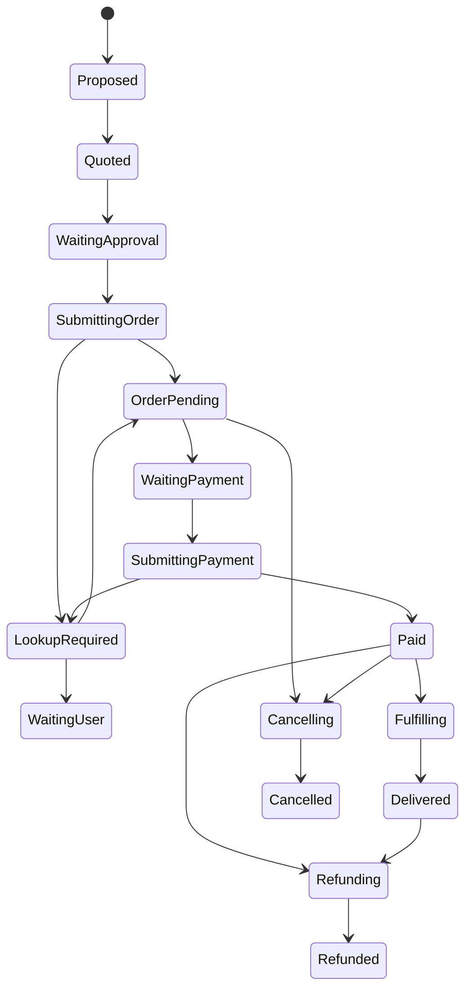

# Commerce Autonomy Design

Date: 2026-07-15
Owner: User + Codex
Status: Approved

## Goal

Phase 8 adds a provider-neutral commerce domain that can search, compare, prepare carts, obtain quotes, place orders, confirm payment, track delivery, cancel, and request refunds without letting a browser, Android device, provider, or assistant become the transaction source of truth.

The first rollout targets food-delivery and Taobao-shaped providers in virtual, observe, and shadow modes. Low-limit live execution remains fail-closed until an exact provider account, executor, role, target, budget, quote, delivery destination, and approval policy are all active.

```text
Commerce intent
  -> normalized offers and exact provider identities
  -> immutable cart and fresh quote digest
  -> Action Fabric policy plus budget reservation
  -> provider command with one idempotency identity
  -> order lookup before every uncertain retry
  -> payment, delivery, cancellation, or refund receipt
  -> Personal Twin events and minimized audit evidence
```

## Decisions

- Commerce owns domain state in `<HERMES_HOME>/personal/commerce-autonomy.db`. It stores normalized public product data, quote breakdowns, provider receipt identifiers, state transitions, and evidence digests. It never stores passwords, cookies, payment credentials, full card numbers, CVVs, provider session material, or raw Android/browser captures.
- A dedicated Commerce Assistant role is the default requester. Purchasing and payment credentials should use a separately isolated Hermes profile. Other roles may recommend commerce intents but cannot inherit spending authority.
- Provider accounts are exact bindings with `virtual`, `food_delivery`, or `taobao` kind and `observe`, `shadow`, or `live` mode. Observe and shadow are not aliases for live: an external-write transport is never invoked in either mode.
- `observe` ingests bounded provider facts and builds projections. `shadow` additionally runs selection, policy, quote, and transaction simulation while producing an explicit `shadowed` receipt and releasing any temporary budget. Only `live` may create an external side effect.
- Native API or MCP adapters are preferred. Browser and Android adapters may implement the same semantic contracts, but raw tools, URLs, selectors, scripts, intents, coordinates, taps, or accessibility primitives are not exposed to roles or HTTP clients.
- Provider price, fees, discounts, item identity, quantity, fulfillment window, address token, recipient token, and substitution policy are material inputs. Any change creates a new quote and requires fresh policy evaluation.
- Payment is a separate critical step from order placement. Phase 8 requires a fresh user approval for every live payment, irrespective of role risk ceiling or configured amount. Approval binds the exact quote, order, provider account, currency, amount, and expiry.
- An uncertain order or payment response is never retried directly. The adapter first performs an order/payment lookup using the durable provider request identity. Unknown state moves the same workflow to takeover.
- Cancellation and refund are explicit semantic capabilities, not generic compensation. They use the original order identity, provider eligibility snapshot, expected refund amount, and a separately verified receipt.
- The Studio emergency stop disables every live commerce executor. Revocation of an account or executor invalidates future commands and prevents a waiting workflow from resuming with stale authority.

## Domain Model

The Commerce database contains bounded records for:

- Provider accounts: stable account ID, provider kind, mode, currency, executor binding, health, policy epoch, and activation state.
- Offer snapshots: provider product/SKU identity, title, merchant, unit, price, availability, fulfillment facts, observation time, expiry, and source digest.
- Comparison sets: exact requirement, candidate snapshot IDs, deterministic score components, exclusions, chosen candidate, and rationale codes.
- Cart revisions: immutable item identities, quantities, accepted substitution rule, destination token, recipient token, and content digest.
- Quotes: item subtotal, delivery/service/tax/discount components, total, currency, provider quote ID, expiry, cart digest, and quote digest.
- Transactions: workflow and intent identity, provider request ID, idempotency identity, order ID, state, expected/actual amount, and version.
- Payment attempts: opaque payment-method token fingerprint, approval identity, provider receipt identity, status, and lookup evidence. No credential material is retained.
- Delivery observations: normalized fulfillment state, bounded ETA, provider event identity, and observation time.
- Cancellation and refund requests: original order binding, reason code, expected amount, provider request/receipt identity, and verified terminal state.
- Append-only checkpoints: semantic stage, evidence digest, stable error code, and timestamp.

Identity fields and material digests are immutable. State transitions and versions are monotonic. Provider event identities and workflow idempotency identities are unique.

## Semantic Capabilities

Initial capabilities are:

- `commerce.product.search`: read normalized provider offers.
- `commerce.offer.compare`: deterministically compare exact offer snapshots.
- `commerce.cart.prepare`: create an immutable proposed cart revision; local in observe/shadow.
- `commerce.quote.refresh`: request or simulate a fresh exact quote.
- `commerce.order.place`: place one order against an unexpired quote.
- `commerce.payment.confirm`: confirm one exact order amount after fresh user approval.
- `commerce.delivery.track`: read current delivery state.
- `commerce.order.cancel`: request cancellation of one eligible order.
- `commerce.refund.request`: request one bounded refund against an eligible order.

Exact target atoms include:

```text
commerce:account:<account-id>
commerce:provider:<provider-kind>
commerce:merchant:<merchant-id>
commerce:currency:<ISO-4217-code>
commerce:destination:<opaque-destination-token>
```

Search and track are read-only. Compare and cart preparation are internal and reversible. Quote refresh is provider-dependent but does not spend money. Order, payment, cancel, and refund use required idempotency and explicit verification.

## Quote And Budget Invariant

A quote is valid only when its cart digest, destination, account, provider, currency, amount breakdown, expiry, and provider quote identity match the current intent. The Action Fabric expected cost equals the exact quote total in integer minor units.

Policy reserves that amount before a live order workflow can execute. On a verified paid order, the ledger commits the verified charged amount. A smaller charge may commit only after the provider receipt proves it. A larger amount, currency change, expired quote, or changed material input requires a new intent/policy decision and cannot reuse the old reservation.

Shadow workflows may exercise budget policy but must release their reservation before terminal success. Cancelled, denied, failed-before-effect, and verified-unpaid workflows release their reservation. Unknown payment state keeps the reservation while waiting for lookup or takeover.

## Durable Transaction State



The provider transaction record supplements rather than replaces the Action Fabric workflow. Action Fabric owns leases, retries, policy, budget, emergency stop, operator actions, and audit. Commerce state supplies transaction-specific invariants and provider lookup evidence.

## Provider Boundary

Every provider adapter implements bounded semantic operations:

```text
searchOffers
refreshQuote
placeOrder
lookupOrder
confirmPayment
lookupPayment
trackDelivery
cancelOrder
lookupCancellation
requestRefund
lookupRefund
```

Requests carry exact normalized identifiers and one durable idempotency key. Responses are normalized before persistence. Raw provider payloads, exception bodies, headers, cookies, tokens, device paths, DOM snapshots, and screenshots do not enter the Commerce database or Action Fabric evidence.

The virtual provider is deterministic and supports injected timeout, effect-before-timeout, quote change, duplicate request, cancellation, refund, and delivery transitions. It is the required acceptance provider before any live account can be activated.

## Observe, Shadow, And Live Rollout

The activation ladder is enforced rather than documented only:

1. Virtual provider contract tests.
2. Observe ingestion with no write-capable executor binding.
3. Shadow transactions using current observed prices and deterministic simulated receipts.
4. Low-limit live activation for one exact provider account and destination.
5. Measured stability over verified transactions and uncertain-result rate.
6. Explicit limit expansion.

Live activation requires super-admin authorization, a healthy exact executor, a configured currency and non-zero spending limit, verified destination and recipient tokens, recent successful shadow evidence, no emergency stop, and an activation review record. Activation never copies secrets into Studio.

## Takeover And Recovery

Login, CAPTCHA, biometric, provider risk review, address confirmation, substitution, price change, and unknown order/payment state create a takeover bound to workflow, transaction, account, quote, policy epoch, and generation. Completion resumes the same workflow at lookup or verification.

After restart, the worker loads the transaction checkpoint. If an external write may have happened, it performs lookup first. It sends the original provider request only when lookup proves the effect did not occur and the same idempotency identity remains valid.

## Twin Projection

Verified commerce outcomes emit idempotent Personal Twin events and outbox records:

- offer observed and comparison completed;
- cart proposed and quote refreshed;
- order placed, paid, cancelled, or refunded;
- delivery state changed and delivered;
- food-delivery nutrition metadata observed, when supplied with provenance and without treating inferred nutrition as measured fact.

One food-delivery order may update commerce, nutrition, schedule, and location projections, but the Commerce transaction remains the canonical order truth.

## Studio Surface

The Commerce command center shows provider mode/health, activation gates, offers and comparison rationale, cart and quote revisions, exact total and expiry, workflow/policy/budget state, order/payment/delivery/cancel/refund timelines, takeovers, and minimized receipts.

The UI has no generic checkout, arbitrary provider URL, raw Android control, cookie/token entry, or payment credential form. Live order and payment confirmations render the exact provider, merchant, items, destination label, amount breakdown, expiry, substitution rule, and approval consequence.

## Security And Privacy

- Payment credentials stay in provider or OS credential boundaries. Studio stores only opaque method labels/fingerprints and provider receipts.
- Full delivery addresses and phone numbers are represented by opaque tokens plus minimized display labels.
- Audit and API DTOs exclude provider payloads, credentials, tokens not intended for display, cookies, raw captures, and local paths.
- Bounds apply to every text, collection, JSON object, price, quantity, timestamp, and response.
- Currency uses uppercase ISO-style three-letter codes and integer minor units. Floating-point money is rejected.
- Cross-account, cross-provider, cross-merchant, cross-destination, quote substitution, receipt substitution, duplicate effect, and stale approval all fail closed.
- A provider cannot raise its own mode, targets, role authority, spending limits, or health.

## Acceptance Criteria

- Taobao-shaped and food-delivery-shaped observations normalize into one bounded offer model without credentials or raw payload persistence.
- The same requirements produce deterministic comparisons and an immutable proposed cart.
- A changed price, fee, item, quantity, destination, substitution rule, expiry, provider, or account invalidates the quote and prior policy material.
- Observe and shadow modes cannot invoke an external-write adapter.
- A live order uses one durable idempotency identity and uncertain results always perform lookup before retry.
- Payment always requires fresh exact approval; unknown payment state cannot charge again.
- Verified charged amount commits the budget exactly once; terminal no-effect outcomes release it.
- Cancel, refund, and delivery transitions bind to the original order and verify provider state.
- Restart, takeover, revocation, and emergency-stop behavior preserve the same durable workflow and authority boundary.
- APIs, UI, audit, Twin projections, and logs expose no payment credentials, session material, raw provider responses, full addresses, or raw device/browser evidence.

