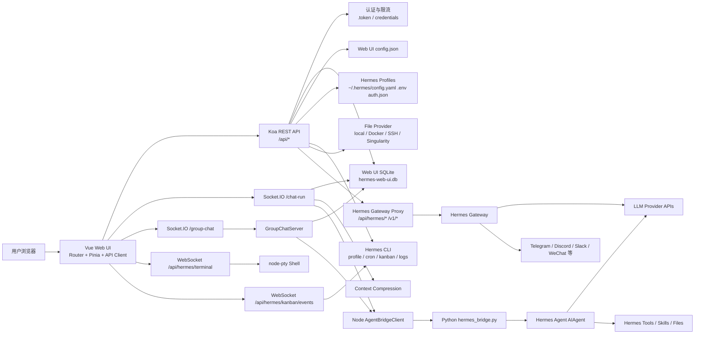
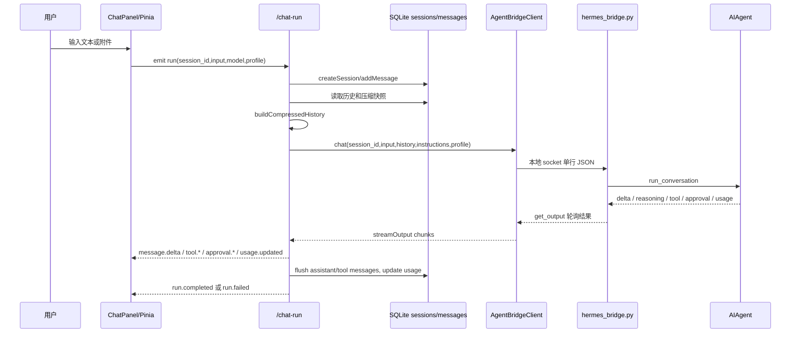
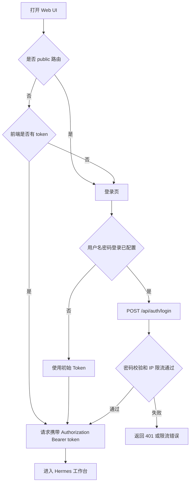
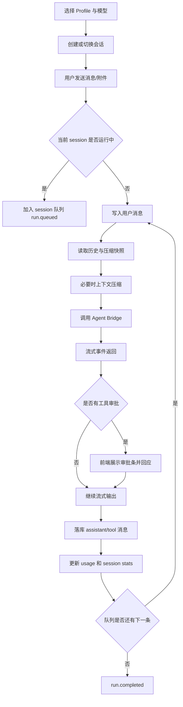
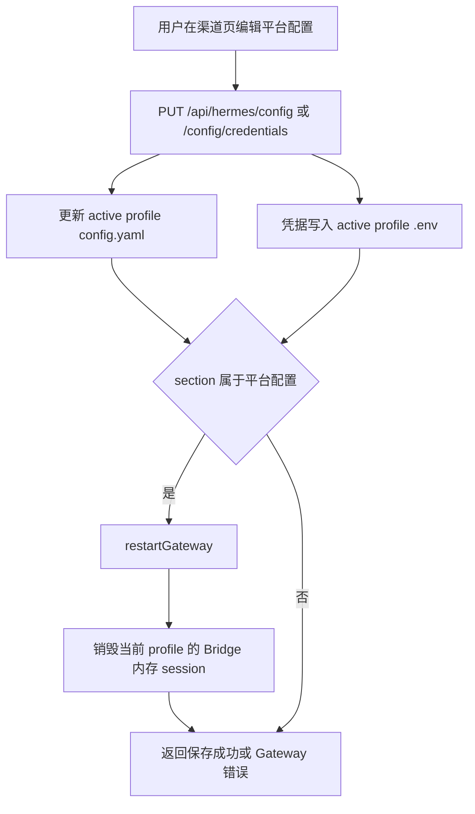
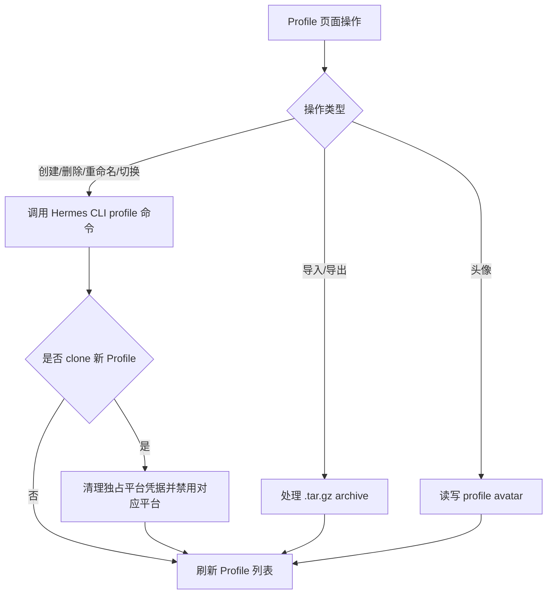
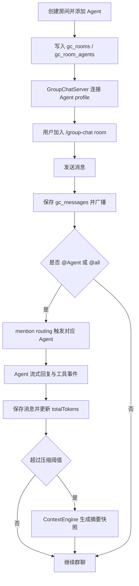

# Hermes Web UI 产品文档

> 本文基于当前代码结构梳理，目标是把实现转译为可读的产品与系统文档。核心参考文件包括 `README_zh.md`、`packages/client/src/router/index.ts`、`packages/server/src/routes/**`、`packages/server/src/services/hermes/**`、`packages/server/src/db/hermes/schemas.ts` 和 `docs/openapi.json`。

## 1. 模块概述

### 1.1 功能定位

Hermes Web UI 是面向 Hermes Agent 的自托管 Web 管理面板。它把原本分散在 CLI、配置文件、Hermes Gateway、Agent Runtime 和本地文件系统中的能力，整合为一个浏览器可操作的工作台。

产品核心定位：

| 维度 | 定位 |
| --- | --- |
| 用户对象 | 使用 Hermes Agent 的个人开发者、AI Agent 操作者、团队管理员 |
| 使用场景 | AI 对话、模型/Provider 管理、渠道配置、定时任务、任务看板、群聊、文件浏览、日志与终端运维 |
| 部署方式 | 本地、WSL、Docker、npm 全局安装的自托管 Web 服务 |
| 架构角色 | 浏览器前端 + Koa BFF + Hermes CLI/Gateway/Agent Bridge 的控制面 |

### 1.2 业务价值

| 价值点 | 说明 |
| --- | --- |
| 降低 Hermes 使用门槛 | 将会话、模型、配置、日志、任务等 CLI 操作可视化，减少命令行和配置文件心智负担。 |
| 统一 Agent 工作台 | 同一界面内完成聊天、Profile 切换、多 Agent 群聊、技能查看、定时任务和 Kanban 调度。 |
| 自托管与数据可控 | Web UI 数据、本地会话库、上传文件、认证 Token 都存储在用户本机或容器挂载目录。 |
| 多平台运营能力 | 集中配置 Telegram、Discord、Slack、WhatsApp、Matrix、飞书、微信、企业微信等渠道。 |
| 运行观测与排障 | 通过日志、用量统计、会话历史、终端、文件浏览器降低运行态排查成本。 |
| 多 Profile 隔离 | 支持不同 Agent 身份、模型、凭据、渠道和缓存的隔离管理。 |

### 1.3 技术形态

| 层级 | 技术与职责 |
| --- | --- |
| 前端 | Vue 3、TypeScript、Vite、Pinia、Vue Router、Naive UI、Socket.IO Client、xterm、markdown-it。负责页面、状态、交互和实时事件渲染。 |
| BFF 服务 | Koa 2、Socket.IO、ws、node-pty、node:sqlite。负责认证、REST API、WebSocket、文件操作、SQLite、Hermes CLI 封装和 Gateway/Bridge 管理。 |
| Hermes Runtime | Hermes CLI、Hermes Gateway、Python Agent Bridge、Hermes Agent `AIAgent`。负责模型调用、Agent 推理、工具、渠道和任务。 |
| 本地存储 | Web UI SQLite/JSON fallback、`~/.hermes-web-ui`、`~/.hermes` profiles、`config.yaml`、`.env`、`auth.json`、cron JSON、日志与上传目录。 |

### 1.4 当前代码事实备注

`docs/cli-chat-sessions.md` 描述过 `api_server` 与 `cli` 双路径分流，但当前 `packages/server/src/services/hermes/run-chat/handle-api-run.ts` 中 `resolveRunSource()` 固定返回 `cli`。因此当前聊天运行实际默认走 Python Agent Bridge 路径，API Server handler 与 proxy 仍保留为兼容和上游 Hermes Gateway 代理能力。

## 2. 核心功能清单

### 2.1 页面与模块

前端路由位于 `packages/client/src/router/index.ts`。

| 页面 | 路由 | 产品能力 |
| --- | --- | --- |
| 登录 | `/` | Token 登录、用户名密码登录状态判断。 |
| 聊天 | `/hermes/chat` | 多会话 AI 聊天、实时流式响应、附件、工具调用、reasoning、队列、中断。 |
| 历史 | `/hermes/history` | 会话检索、历史消息查看、导出、删除、Hermes 只读历史查看。 |
| 定时任务 | `/hermes/jobs` | Cron 任务创建、编辑、暂停、恢复、立即运行、历史查看。 |
| Kanban | `/hermes/kanban` | Hermes Kanban 任务板、任务详情、分配、阻塞、完成、调度、事件流。 |
| 模型 | `/hermes/models` | Provider 管理、模型发现、默认模型、别名、可见性、上下文窗口配置。 |
| Profiles | `/hermes/profiles` | Profile 创建、克隆、重命名、切换、导入、导出、运行状态、头像。 |
| 日志 | `/hermes/logs` | Agent/Gateway/Error 日志读取与过滤。 |
| 用量 | `/hermes/usage` | Token、成本、模型分布、趋势统计。 |
| 技能用量 | `/hermes/skills-usage` | 技能使用统计与分析。 |
| 技能 | `/hermes/skills` | 技能列表、详情、文件、启用/禁用、置顶。 |
| 插件 | `/hermes/plugins` | 插件列表浏览。 |
| 记忆 | `/hermes/memory` | 用户笔记、档案和 memory 内容读写。 |
| 设置 | `/hermes/settings` | 显示、Agent、压缩、记忆、模型、隐私、账户、语音等设置。 |
| 渠道 | `/hermes/channels` | 平台渠道配置与凭据写入。 |
| 终端 | `/hermes/terminal` | Web 终端，多 PTY session，输入输出与窗口 resize。 |
| 群聊 | `/hermes/group-chat` | 房间、多 Agent 成员、@ 提及、上下文压缩、审批、中断。 |
| 文件 | `/hermes/files` | 文件浏览、预览、上传、下载、编辑、复制、移动、删除。 |

### 2.2 主要业务场景

| 场景 | 用户目标 | 系统动作 |
| --- | --- | --- |
| 首次进入 Web UI | 登录并进入管理台 | 校验 Token 或用户名密码，成功后保存 API token 到前端请求层。 |
| 发起 AI 会话 | 与当前 Profile 的 Agent 对话 | 前端通过 `/chat-run` Socket.IO 发送 run，后端落库用户消息，构建上下文，调用 Agent Bridge，流式返回消息、reasoning、工具和用量。 |
| 管理会话历史 | 查找、重命名、删除、导出历史 | 后端从 Web UI SQLite 读取本地会话，并可从 Hermes CLI 读取只读 Hermes 历史。 |
| 切换模型 | 更换默认模型或 Provider | 写入 active profile 的 `config.yaml`，同时 Web UI 用 app config 保存别名、可见性和自定义模型。 |
| 配置渠道 | 接入 Telegram/Discord/Slack 等平台 | 凭据写入 active profile `.env`，行为配置写入 `config.yaml`，需要时重启 Hermes Gateway 并清理 Bridge 内存 session。 |
| 管理 Profile | 隔离 Agent 身份和配置 | 调用 Hermes CLI profile 命令，并读写 profile 目录；克隆时清理独占平台凭据。 |
| 创建定时任务 | 让 Agent 按 Cron 执行 | BFF 封装 `hermes cron` 命令，读取 profile 下 `cron/jobs.json` 作为展示源。 |
| 管理任务板 | 跟踪 Agent 工作任务 | BFF 封装 `hermes kanban` CLI，提供 REST API 与事件 WebSocket。 |
| 多 Agent 群聊 | 让多个 profile 对同一房间协作 | 房间和消息写入 SQLite，Agent client 连接不同 profile，@ 提及时触发对应 Agent 回复。 |
| 运维排障 | 查看文件、日志和终端 | BFF 通过 file-provider、Hermes CLI logs、node-pty 暴露受控操作能力。 |

## 3. 数据流图

### 3.1 总体数据流

### 3.2 聊天运行数据流

### 3.3 关键输入输出与数据结构

| 数据对象 | 输入来源 | 输出去向 | 主要字段 |
| --- | --- | --- | --- |
| `ContentBlock` | ChatInput 附件或文本 | Agent Bridge / DB 文本预览 | `type=text|image|file`、`text`、`name`、`path`、`media_type` |
| `SessionMessage` | 用户输入、Agent 流式输出、工具事件 | `messages` 表、前端消息列表 | `role`、`content`、`tool_calls`、`reasoning`、`timestamp`、`finish_reason` |
| `SessionState` | `/chat-run` 内存态 | resume、队列、中断、运行事件 | `messages`、`isWorking`、`queue`、`runId`、`profile`、`source`、token counters |
| `AvailableModelGroup` | `.env`、`auth.json`、Provider `/models`、presets | 模型选择器与模型页 | `provider`、`label`、`base_url`、`models`、`available_models`、`model_meta` |
| `Profile` | Hermes profile 目录和 CLI | Profile 列表与运行控制 | `name`、`active`、`model`、`gatewayStatus`、`path` |
| `JobRecord` | `cron/jobs.json` 与 Hermes CLI | 任务列表和详情 | `job_id`、`schedule_display`、`prompt`、`skills`、`enabled`、`state`、`last_status` |
| `KanbanTask` | `hermes kanban` CLI JSON | Kanban 页面 | `id`、`title`、`status`、`assignee`、`priority`、`result`、`skills` |
| `GroupChatRoom` | REST 创建房间 | 群聊 Socket 与 DB | `id`、`name`、`inviteCode`、`triggerTokens`、`maxHistoryTokens`、`totalTokens` |

## 4. 业务流程图

### 4.1 登录与鉴权流程

### 4.2 AI 聊天流程

### 4.3 渠道配置流程

### 4.4 Profile 管理流程

### 4.5 群聊流程

## 5. API 清单

完整机器可读定义位于 `docs/openapi.json`。当前源码路由抽取约 154 个 route 声明，OpenAPI 文档覆盖约 129 个 HTTP operation；Socket.IO 和部分 WebSocket/动态路由需要结合源码阅读。

### 5.1 公共与认证

| 方法 | 路径 | 描述 |
| --- | --- | --- |
| `GET` | `/health` | 服务健康检查，返回版本、Node 版本、更新状态等。 |
| `POST` | `/webhook` | Webhook 接入口。 |
| `POST` | `/upload` | 通用上传接口。 |
| `GET` | `/api/auth/status` | 查询是否配置用户名密码登录。 |
| `POST` | `/api/auth/login` | 用户名密码登录，成功后返回 Web UI token。 |
| `POST` | `/api/auth/setup` | 配置用户名密码登录。 |
| `POST` | `/api/auth/change-password` | 修改登录密码。 |
| `POST` | `/api/auth/change-username` | 修改登录用户名。 |
| `DELETE` | `/api/auth/password` | 移除用户名密码登录。 |
| `GET` | `/api/auth/locked-ips` | 查看被限流锁定的 IP。 |
| `DELETE` | `/api/auth/locked-ips` | 解锁指定或全部 IP。 |

### 5.2 聊天与会话

| 类型 | 路径/事件 | 描述 |
| --- | --- | --- |
| Socket.IO | namespace `/chat-run` | AI 聊天实时通道。 |
| Client event | `run` | 启动一轮会话运行。payload 包含 `session_id`、`input`、`model`、`provider`、`profile`、`source`。 |
| Client event | `resume` | 恢复指定 session 的消息、运行状态和队列。 |
| Client event | `abort` | 中断当前运行。 |
| Client event | `cancel_queued_run` | 取消排队中的 run。 |
| Client event | `approval.respond` | 回复工具审批。 |
| Server event | `run.started`、`message.delta`、`reasoning.delta`、`thinking.delta` | 运行开始和流式输出。 |
| Server event | `tool.started`、`tool.completed` | 工具调用开始和结束。 |
| Server event | `approval.requested`、`approval.resolved` | 工具审批请求和处理结果。 |
| Server event | `compression.started`、`compression.completed` | 上下文压缩状态。 |
| Server event | `usage.updated`、`run.completed`、`run.failed` | 用量更新和终态。 |
| `GET` | `/api/hermes/sessions` | Web UI 本地会话列表。 |
| `GET` | `/api/hermes/sessions/:id` | 会话详情。 |
| `DELETE` | `/api/hermes/sessions/:id` | 删除单个会话。 |
| `POST` | `/api/hermes/sessions/batch-delete` | 批量删除会话。 |
| `POST` | `/api/hermes/sessions/:id/rename` | 重命名会话。 |
| `POST` | `/api/hermes/sessions/:id/workspace` | 设置会话工作目录。 |
| `POST` | `/api/hermes/sessions/:id/model` | 设置会话模型与 Provider。 |
| `GET` | `/api/hermes/sessions/:id/export` | 导出会话。 |
| `GET` | `/api/hermes/sessions/:id/usage` | 查询单会话用量。 |
| `GET` | `/api/hermes/sessions/usage` | 批量查询会话用量。 |
| `GET` | `/api/hermes/usage/stats` | 聚合用量统计。 |
| `GET` | `/api/hermes/sessions/context-length` | 查询上下文长度相关信息。 |
| `GET` | `/api/hermes/sessions/conversations` | 本地 conversation 列表。 |
| `GET` | `/api/hermes/sessions/conversations/:id/messages` | conversation 消息。 |
| `GET` | `/api/hermes/sessions/conversations/:id/messages/paginated` | conversation 分页消息。 |
| `GET` | `/api/hermes/sessions/hermes` | 只读 Hermes CLI 历史会话列表。 |
| `GET` | `/api/hermes/sessions/hermes/:id` | 只读 Hermes CLI 历史详情。 |
| `GET` | `/api/hermes/search/sessions`、`/api/hermes/sessions/search` | 搜索 Web UI 本地会话。 |
| `GET` | `/api/hermes/workspace/folders` | 列出可选工作目录。 |

### 5.3 Profile

| 方法 | 路径 | 描述 |
| --- | --- | --- |
| `GET` | `/api/hermes/profiles` | Profile 列表。 |
| `POST` | `/api/hermes/profiles` | 创建 Profile，可 clone 当前配置。 |
| `GET` | `/api/hermes/profiles/:name` | Profile 详情。 |
| `DELETE` | `/api/hermes/profiles/:name` | 删除 Profile。 |
| `POST` | `/api/hermes/profiles/:name/rename` | 重命名 Profile。 |
| `PUT` | `/api/hermes/profiles/active` | 切换 active profile。 |
| `POST` | `/api/hermes/profiles/:name/export` | 导出 Profile 归档。 |
| `POST` | `/api/hermes/profiles/import` | 导入 Profile 归档。 |
| `GET` | `/api/hermes/profiles/runtime-statuses` | 查询所有 Profile 运行态。 |
| `GET` | `/api/hermes/profiles/:name/runtime-status` | 查询单个 Profile 运行态。 |
| `POST` | `/api/hermes/profiles/:name/restart` | 重启 Profile runtime。 |
| `POST` | `/api/hermes/profiles/:name/gateway/restart` | 重启 Profile Gateway。 |
| `PUT` | `/api/hermes/profiles/:name/avatar` | 更新头像。 |
| `DELETE` | `/api/hermes/profiles/:name/avatar` | 删除头像。 |

### 5.4 配置、渠道、模型与 Provider

| 方法 | 路径 | 描述 |
| --- | --- | --- |
| `GET` | `/api/hermes/config` | 读取 active profile 配置，可按 section 过滤。 |
| `PUT` | `/api/hermes/config` | 更新 `config.yaml` 指定 section。 |
| `PUT` | `/api/hermes/config/credentials` | 更新平台凭据到 `.env`，并同步配置展示。 |
| `GET` | `/api/hermes/available-models` | 汇总所有 Profile 和 Provider 可用模型。 |
| `GET` | `/api/hermes/config/models` | 读取配置中的模型分组。 |
| `PUT` | `/api/hermes/config/model` | 设置默认模型和 Provider。 |
| `POST` | `/api/hermes/provider-models` | 从 OpenAI-compatible Provider `/models` 拉取模型。 |
| `POST` | `/api/hermes/config/providers` | 新增 Provider。 |
| `PUT` | `/api/hermes/config/providers/:poolKey` | 更新 Provider。 |
| `DELETE` | `/api/hermes/config/providers/:poolKey` | 删除 Provider。 |
| `PUT` | `/api/hermes/model-alias` | 设置模型显示别名。 |
| `PUT` | `/api/hermes/model-visibility` | 设置模型选择器可见性。 |
| `PUT` | `/api/hermes/custom-model` | 添加自定义模型 ID。 |
| `DELETE` | `/api/hermes/custom-model` | 删除自定义模型 ID。 |
| `GET` | `/api/hermes/model-context`、`/api/hermes/model-context/:provider/:model` | 查询模型上下文窗口配置。 |
| `PUT` | `/api/hermes/model-context`、`/api/hermes/model-context/:provider/:model` | 写入模型上下文窗口配置。 |
| `POST` | `/api/hermes/auth/codex/start` | 启动 Codex OAuth 登录。 |
| `GET` | `/api/hermes/auth/codex/poll/:sessionId` | 轮询 Codex OAuth 登录。 |
| `GET` | `/api/hermes/auth/codex/status` | 查询 Codex OAuth 状态。 |
| `POST` | `/api/hermes/auth/nous/start` | 启动 Nous OAuth 登录。 |
| `GET` | `/api/hermes/auth/nous/poll/:sessionId` | 轮询 Nous OAuth 登录。 |
| `GET` | `/api/hermes/auth/nous/status` | 查询 Nous OAuth 状态。 |
| `POST` | `/api/hermes/auth/xai/start` | 启动 xAI OAuth 登录。 |
| `GET` | `/api/hermes/auth/xai/poll/:sessionId` | 轮询 xAI OAuth 登录。 |
| `GET` | `/api/hermes/auth/xai/status` | 查询 xAI OAuth 状态。 |
| `POST` | `/api/hermes/auth/copilot/start` | 启动 Copilot device flow。 |
| `GET` | `/api/hermes/auth/copilot/poll/:sessionId` | 轮询 Copilot device flow。 |
| `GET` | `/api/hermes/auth/copilot/check-token` | 检查 Copilot token。 |
| `POST` | `/api/hermes/auth/copilot/enable` | 启用 Copilot Provider。 |
| `POST` | `/api/hermes/auth/copilot/disable` | 禁用 Copilot Provider。 |
| `GET` | `/api/hermes/weixin/qrcode` | 获取微信扫码登录二维码。 |
| `GET` | `/api/hermes/weixin/qrcode/status` | 查询微信扫码状态。 |
| `POST` | `/api/hermes/weixin/save` | 保存微信凭据。 |

### 5.5 文件、下载、日志、终端

| 方法/类型 | 路径 | 描述 |
| --- | --- | --- |
| `GET` | `/api/hermes/files/list` | 列目录。 |
| `GET` | `/api/hermes/files/stat` | 文件或目录详情。 |
| `GET` | `/api/hermes/files/read` | 读取可编辑文件内容。 |
| `PUT` | `/api/hermes/files/write` | 写文件，拒绝敏感路径和超限内容。 |
| `DELETE` | `/api/hermes/files/delete` | 删除文件或目录。 |
| `POST` | `/api/hermes/files/rename` | 重命名或移动。 |
| `POST` | `/api/hermes/files/mkdir` | 创建目录。 |
| `POST` | `/api/hermes/files/copy` | 复制文件。 |
| `POST` | `/api/hermes/files/upload` | multipart 上传到指定目录。 |
| `GET` | `/api/hermes/download` | 下载文件，支持多 backend。 |
| `GET` | `/api/hermes/logs` | 日志文件列表。 |
| `GET` | `/api/hermes/logs/:name` | 读取指定日志内容。 |
| WebSocket | `/api/hermes/terminal` | Web 终端连接，控制消息支持 `create`、`switch`、`close`、`resize`。 |

### 5.6 Jobs、Cron History、Kanban

| 方法/类型 | 路径 | 描述 |
| --- | --- | --- |
| `GET` | `/api/hermes/jobs` | 任务列表。 |
| `GET` | `/api/hermes/jobs/:id` | 任务详情。 |
| `POST` | `/api/hermes/jobs` | 创建 Cron 任务。 |
| `PATCH` | `/api/hermes/jobs/:id` | 更新任务。 |
| `DELETE` | `/api/hermes/jobs/:id` | 删除任务。 |
| `POST` | `/api/hermes/jobs/:id/pause` | 暂停任务。 |
| `POST` | `/api/hermes/jobs/:id/resume` | 恢复任务。 |
| `POST` | `/api/hermes/jobs/:id/run` | 立即运行任务。 |
| `GET` | `/api/cron-history` | Cron 运行历史列表。 |
| `GET` | `/api/cron-history/:jobId/:fileName` | 读取某次运行历史文件。 |
| `GET` | `/api/hermes/kanban/boards` | 看板列表。 |
| `POST` | `/api/hermes/kanban/boards` | 创建看板。 |
| `DELETE` | `/api/hermes/kanban/boards/:slug` | 归档看板。 |
| `GET` | `/api/hermes/kanban` | 任务列表。 |
| `POST` | `/api/hermes/kanban` | 创建任务。 |
| `GET` | `/api/hermes/kanban/:id` | 任务详情。 |
| `POST` | `/api/hermes/kanban/:id/assign` | 分配任务。 |
| `POST` | `/api/hermes/kanban/:id/block` | 阻塞任务。 |
| `POST` | `/api/hermes/kanban/unblock` | 批量解除阻塞。 |
| `POST` | `/api/hermes/kanban/complete` | 完成任务。 |
| `POST` | `/api/hermes/kanban/:id/comments` | 添加评论。 |
| `GET` | `/api/hermes/kanban/:id/log` | 查看任务 worker 日志。 |
| `POST` | `/api/hermes/kanban/:id/reclaim` | 回收任务。 |
| `POST` | `/api/hermes/kanban/:id/reassign` | 重分配任务。 |
| `POST` | `/api/hermes/kanban/:id/specify` | 生成/补充任务规格。 |
| `POST` | `/api/hermes/kanban/dispatch` | 调度任务。 |
| `POST` | `/api/hermes/kanban/tasks/bulk` | 批量更新任务。 |
| `POST`/`DELETE` | `/api/hermes/kanban/links` | 建立或移除任务依赖。 |
| `GET` | `/api/hermes/kanban/stats` | Kanban 统计。 |
| `GET` | `/api/hermes/kanban/assignees` | assignee 列表。 |
| `GET` | `/api/hermes/kanban/capabilities` | 查询 Kanban CLI 能力支持矩阵。 |
| `GET` | `/api/hermes/kanban/diagnostics` | 诊断信息。 |
| `GET` | `/api/hermes/kanban/artifact` | 读取任务 artifact。 |
| `GET` | `/api/hermes/kanban/search-sessions` | 搜索可关联会话。 |
| WebSocket | `/api/hermes/kanban/events` | 监听 board-scoped kanban watch 事件。 |

### 5.7 群聊、技能、记忆、插件与媒体

| 方法/类型 | 路径/事件 | 描述 |
| --- | --- | --- |
| `GET` | `/api/hermes/group-chat/rooms` | 房间列表。 |
| `POST` | `/api/hermes/group-chat/rooms` | 创建房间并添加 Agent。 |
| `GET` | `/api/hermes/group-chat/rooms/:roomId` | 房间详情、消息、Agent、成员。 |
| `DELETE` | `/api/hermes/group-chat/rooms/:roomId` | 删除房间并断开 Agent。 |
| `POST` | `/api/hermes/group-chat/rooms/:roomId/clone` | 克隆房间角色与压缩配置。 |
| `GET` | `/api/hermes/group-chat/rooms/join/:code` | 通过邀请码查找房间。 |
| `PUT` | `/api/hermes/group-chat/rooms/:roomId/invite-code` | 更新邀请码。 |
| `GET` | `/api/hermes/group-chat/rooms/:roomId/agents` | 房间 Agent 列表。 |
| `POST` | `/api/hermes/group-chat/rooms/:roomId/agents` | 添加 Agent 到房间。 |
| `DELETE` | `/api/hermes/group-chat/rooms/:roomId/agents/:agentId` | 移除 Agent。 |
| `POST` | `/api/hermes/group-chat/rooms/:roomId/clear-context` | 清空房间上下文。 |
| `PUT` | `/api/hermes/group-chat/rooms/:roomId/config` | 更新压缩参数。 |
| `POST` | `/api/hermes/group-chat/rooms/:roomId/compress` | 立即压缩上下文。 |
| Socket.IO | namespace `/group-chat` | 群聊实时通道。 |
| Group event | `join`、`message`、`typing`、`stop_typing` | 加入、发送消息、输入状态。 |
| Group event | `message_stream_start/delta/end`、`message_reasoning_delta` | Agent 流式回复。 |
| Group event | `context_status`、`interrupt_agent` | Agent 状态和中断。 |
| Group event | `approval.requested/resolved/respond` | 工具审批。 |
| `GET` | `/api/hermes/skills` | 技能列表。 |
| `GET` | `/api/hermes/skills/usage/stats` | 技能使用统计。 |
| `PUT` | `/api/hermes/skills/toggle` | 启用或禁用技能。 |
| `PUT` | `/api/hermes/skills/pin` | 置顶或取消置顶技能。 |
| `GET` | `/api/hermes/skills/:category/:skill/files` | 技能附件文件列表。 |
| `GET` | `/api/hermes/skills/{*path}` | 读取技能文件。 |
| `GET` | `/api/hermes/plugins` | 插件列表。 |
| `GET`/`POST` | `/api/hermes/memory` | 读取或更新 memory。 |
| `POST` | `/api/hermes/tts` | TTS 生成。 |
| `POST` | `/api/tts/proxy/audio/speech` | TTS 代理。 |
| `POST` | `/api/hermes/media/apikey-image-generate` | API key 图片生成能力。 |
| `POST` | `/api/hermes/media/grok-image-to-video` | Grok 图片转视频能力。 |
| `POST` | `/api/hermes/update` | Web UI 自更新。 |
| `ALL` | `/api/hermes/{*any}`、`/v1/{*any}` | 代理到当前 Profile 的 Hermes Gateway。 |

## 6. 数据模型

### 6.1 存储位置

| 数据 | 开发环境 | 生产环境 | 说明 |
| --- | --- | --- | --- |
| Web UI SQLite | `packages/server/data/hermes-web-ui.db` | `$HERMES_WEB_UI_HOME/hermes-web-ui.db` | Node >= 22.5 时使用 `node:sqlite`。 |
| JSON fallback | `packages/server/data/hermes-web-ui.json` | `$HERMES_WEB_UI_HOME/hermes-web-ui.json` | SQLite 不可用时 fallback。 |
| Web UI config | 同生产逻辑 | `$HERMES_WEB_UI_HOME/config.json` | 模型别名、可见性、自定义模型、Copilot 启用标记。 |
| Web UI Token | 同生产逻辑 | `$HERMES_WEB_UI_HOME/.token` | 未设置 `AUTH_TOKEN` 时自动生成。 |
| 登录凭据 | 同生产逻辑 | `$HERMES_WEB_UI_HOME` 下凭据文件 | 由 `services/credentials.ts` 管理。 |
| Hermes 默认 Profile | `~/.hermes` | `~/.hermes` 或环境变量检测目录 | `config.yaml`、`.env`、`auth.json`、`active_profile`。 |
| 非默认 Profile | `~/.hermes/profiles/{name}` | 同左 | Profile 级配置与凭据隔离。 |
| Cron 任务 | `{profileDir}/cron/jobs.json` | 同左 | Hermes CLI cron 的数据源。 |
| 上传文件 | `$HERMES_WEB_UI_HOME/upload` | 可由 `UPLOAD_DIR` 覆盖 | 聊天附件和文件能力使用。 |

### 6.2 SQLite 表

#### `sessions`

| 字段 | 类型/约束 | 描述 |
| --- | --- | --- |
| `id` | `TEXT PRIMARY KEY` | 会话 ID。 |
| `profile` | `TEXT DEFAULT 'default'` | 所属 Hermes Profile。 |
| `source` | `TEXT DEFAULT 'api_server'` | 会话来源，当前聊天运行代码实际走 `cli`。 |
| `user_id` | `TEXT` | 用户或平台用户 ID。 |
| `model` | `TEXT` | 本会话模型。 |
| `provider` | `TEXT` | 本会话 Provider。 |
| `title` | `TEXT` | 会话标题。 |
| `started_at` | `INTEGER` | 开始时间，Unix 秒。 |
| `ended_at` | `INTEGER` | 结束时间。 |
| `end_reason` | `TEXT` | 结束原因。 |
| `message_count` | `INTEGER` | 消息数。 |
| `tool_call_count` | `INTEGER` | 工具调用数。 |
| `input_tokens` | `INTEGER` | 输入 token 累计。 |
| `output_tokens` | `INTEGER` | 输出 token 累计。 |
| `cache_read_tokens` | `INTEGER` | 缓存读取 token。 |
| `cache_write_tokens` | `INTEGER` | 缓存写入 token。 |
| `reasoning_tokens` | `INTEGER` | reasoning token。 |
| `billing_provider` | `TEXT` | 计费 Provider。 |
| `estimated_cost_usd` | `REAL` | 预估成本。 |
| `actual_cost_usd` | `REAL` | 实际成本。 |
| `cost_status` | `TEXT` | 成本状态。 |
| `preview` | `TEXT` | 会话预览文本。 |
| `last_active` | `INTEGER` | 最后活跃时间。 |
| `workspace` | `TEXT` | 会话工作目录。 |

#### `messages`

| 字段 | 类型/约束 | 描述 |
| --- | --- | --- |
| `id` | `INTEGER PRIMARY KEY AUTOINCREMENT` | 消息自增 ID。 |
| `session_id` | `TEXT NOT NULL` | 所属 session。 |
| `role` | `TEXT NOT NULL` | `user`、`assistant`、`tool` 等角色。 |
| `content` | `TEXT DEFAULT ''` | 消息正文。 |
| `tool_call_id` | `TEXT` | 工具调用 ID。 |
| `tool_calls` | `TEXT` | 工具调用 JSON 字符串。 |
| `tool_name` | `TEXT` | 工具名称。 |
| `timestamp` | `INTEGER` | 消息时间，Unix 秒。 |
| `token_count` | `INTEGER` | 单条消息 token 数。 |
| `finish_reason` | `TEXT` | 完成原因。 |
| `reasoning` | `TEXT` | reasoning 展示内容。 |
| `reasoning_details` | `TEXT` | reasoning 结构化详情。 |
| `reasoning_content` | `TEXT` | reasoning 原始内容。 |

索引：`idx_messages_session_id ON messages(session_id)`。

#### `session_usage`

| 字段 | 类型/约束 | 描述 |
| --- | --- | --- |
| `id` | `INTEGER PRIMARY KEY AUTOINCREMENT` | 用量记录 ID。 |
| `session_id` | `TEXT NOT NULL` | 所属 session。 |
| `input_tokens` | `INTEGER` | 输入 token。 |
| `output_tokens` | `INTEGER` | 输出 token。 |
| `cache_read_tokens` | `INTEGER` | 缓存读取 token。 |
| `cache_write_tokens` | `INTEGER` | 缓存写入 token。 |
| `reasoning_tokens` | `INTEGER` | reasoning token。 |
| `model` | `TEXT` | 模型。 |
| `profile` | `TEXT DEFAULT 'default'` | Profile。 |
| `created_at` | `INTEGER` | 记录时间。 |

#### `chat_compression_snapshots`

| 字段 | 类型/约束 | 描述 |
| --- | --- | --- |
| `session_id` | `TEXT PRIMARY KEY` | 会话 ID。 |
| `summary` | `TEXT` | 压缩摘要。 |
| `last_message_index` | `INTEGER` | 摘要覆盖到的消息索引。 |
| `message_count_at_time` | `INTEGER` | 压缩时消息总数。 |
| `updated_at` | `INTEGER` | 更新时间。 |

#### `model_context`

| 字段 | 类型/约束 | 描述 |
| --- | --- | --- |
| `id` | `INTEGER PRIMARY KEY AUTOINCREMENT` | 记录 ID。 |
| `provider` | `TEXT NOT NULL` | Provider key。 |
| `model` | `TEXT NOT NULL` | 模型 ID。 |
| `context_limit` | `INTEGER NOT NULL` | 上下文窗口限制。 |

唯一索引：`idx_model_context_provider_model ON model_context(provider, model)`。

#### 群聊相关表

| 表 | 关键字段 | 描述 |
| --- | --- | --- |
| `gc_rooms` | `id`、`name`、`inviteCode`、`triggerTokens`、`maxHistoryTokens`、`tailMessageCount`、`totalTokens`、`sessionSeed` | 群聊房间和上下文压缩配置。 |
| `gc_messages` | `id`、`roomId`、`senderId`、`senderName`、`content`、`timestamp`、`role`、`tool_calls`、`reasoning` | 群聊消息、Agent 回复、工具和 reasoning。 |
| `gc_room_agents` | `id`、`roomId`、`agentId`、`profile`、`name`、`description`、`invited` | 房间内 Agent 身份和绑定 Profile。 |
| `gc_room_members` | `id`、`roomId`、`userId`、`userName`、`description`、`joinedAt`、`updatedAt` | 房间成员。 |
| `gc_context_snapshots` | `roomId`、`summary`、`lastMessageId`、`lastMessageTimestamp`、`updatedAt` | 群聊上下文摘要快照。 |
| `gc_pending_session_deletes` | `session_id`、`profile_name`、`status`、`attempt_count`、`last_error`、`next_attempt_at` | 群聊 Agent session 延迟删除队列。 |
| `gc_session_profiles` | `session_id`、`room_id`、`agent_id`、`profile_name`、`created_at` | 群聊 session 与 Profile 映射。 |

索引：

| 索引 | 描述 |
| --- | --- |
| `idx_gc_room_agents_profile` | 按 Profile 查询 room agent。 |
| `idx_gc_room_members_user` | 按 userId 查询 room member。 |
| `idx_gc_messages_room` | 按 roomId 和 timestamp 查询消息。 |

### 6.3 文件型数据模型

| 文件 | 读写方 | 描述 |
| --- | --- | --- |
| `~/.hermes/active_profile` | `hermes-profile.ts`、Hermes CLI | 当前 active profile 名称。 |
| `{profileDir}/config.yaml` | Config、Models、Channels、Hermes CLI | Hermes 行为配置，包含模型、平台、工具和 Agent 配置。 |
| `{profileDir}/.env` | Config credentials、Provider discovery、Hermes runtime | Provider API key、渠道 token、平台凭据。 |
| `{profileDir}/auth.json` | OAuth controllers、Models | Codex/Nous/xAI/Copilot 等 OAuth credential pool。 |
| `$HERMES_WEB_UI_HOME/config.json` | `app-config.ts` | Web UI 自有设置，不改写 Hermes canonical model ID。 |
| `{profileDir}/cron/jobs.json` | Jobs controller | Hermes cron job 展示源。 |
| Hermes Kanban storage | `hermes-kanban.ts` 通过 CLI 访问 | Kanban board/task/comment/run/event 由 Hermes CLI 管理。 |
| 日志文件 | `hermes logs` CLI | Agent、gateway、errors 等日志。 |

## 7. 依赖关系

### 7.1 上下游交互

| 调用方 | 被调用方 | 协议/方式 | 用途 |
| --- | --- | --- | --- |
| 浏览器前端 | Koa BFF | HTTP REST | 配置、会话、模型、Profile、文件、日志等。 |
| 浏览器前端 | `/chat-run` | Socket.IO | AI 聊天实时流式事件。 |
| 浏览器前端 | `/group-chat` | Socket.IO | 群聊消息、Agent 回复、审批、状态。 |
| 浏览器前端 | `/api/hermes/terminal` | WebSocket | Web 终端 PTY 输入输出。 |
| 浏览器前端 | `/api/hermes/kanban/events` | WebSocket | Kanban watch 事件。 |
| Koa BFF | Web UI SQLite | `node:sqlite` | 会话、消息、用量、压缩快照、群聊数据。 |
| Koa BFF | Hermes CLI | `execFile` / `spawn` | profile、cron、kanban、logs、gateway 管理。 |
| Koa BFF | Hermes Gateway | HTTP proxy / SSE | 代理 `/api/hermes/*` 与 `/v1/*`，兼容 Gateway API。 |
| Koa BFF | Python Agent Bridge | TCP 或 Unix socket 单行 JSON | 运行 AIAgent、流式拉取输出、审批、中断、压缩响应。 |
| Python Agent Bridge | Hermes Agent | Python import / in-process | 创建并运行 `AIAgent`。 |
| Hermes Agent/Gateway | LLM Provider | OpenAI-compatible HTTP / OAuth | 模型推理、模型列表、凭据授权。 |
| Hermes Gateway | 平台渠道 | 各平台 SDK/API | Telegram、Discord、Slack、Matrix、微信等消息收发。 |
| Koa BFF | File Provider | 本地/容器/SSH/Singularity 操作 | 文件浏览、读写、上传、下载。 |
| Koa BFF | OS shell | node-pty | 终端能力。 |

### 7.2 前端依赖

| 依赖 | 作用 |
| --- | --- |
| `vue`、`vue-router`、`pinia` | SPA、路由与状态管理。 |
| `naive-ui` | UI 组件。 |
| `socket.io-client` | 聊天与群聊实时通信。 |
| `markdown-it`、`highlight.js`、`mermaid` | Markdown、代码高亮、图表渲染。 |
| `@xterm/xterm`、addons | Web 终端。 |
| `vue-i18n` | 多语言。 |
| `axios` | HTTP API client。 |

### 7.3 后端依赖

| 依赖 | 作用 |
| --- | --- |
| `koa`、`@koa/router`、`@koa/bodyparser`、`@koa/cors` | BFF HTTP 服务。 |
| `socket.io`、`ws` | Socket.IO 和原生 WebSocket。 |
| `node:sqlite` | Web UI 本地数据库。 |
| `node-pty` | Web 终端 PTY。 |
| `js-yaml` | Hermes `config.yaml` 读写。 |
| `node-edge-tts` | TTS。 |
| `eventsource` | SSE 客户端能力。 |
| `pino` | 结构化日志。 |
| `tsoa`、`scripts/generate-openapi.mjs` | OpenAPI 生成。 |

### 7.4 运行时外部依赖

| 依赖 | 说明 |
| --- | --- |
| Node.js `>=23.0.0` | package.json 约束；SQLite 逻辑要求 Node 22.5+ 才可用。 |
| Hermes CLI | profile、gateway、cron、kanban、logs 等能力的实际执行者。 |
| Hermes Agent Python runtime | Python bridge 通过 `run_agent.AIAgent` 执行 Agent 会话。 |
| Python | Agent Bridge 子进程运行环境，可由 `HERMES_AGENT_BRIDGE_PYTHON` 指定。 |
| LLM Provider API | OpenAI-compatible、OpenRouter、Anthropic、Gemini、xAI、Nous、Codex、Copilot 等。 |
| 平台 API | Telegram、Discord、Slack、WhatsApp、Matrix、飞书、微信、企业微信等。 |
| 文件 backend | local、Docker、SSH、Singularity。 |

## 8. 产品边界与注意事项

| 项目 | 说明 |
| --- | --- |
| 当前聊天主路径 | 当前代码固定走 `cli` Agent Bridge。若未来恢复 API Server 分流，需要更新 `resolveRunSource()` 和本文档。 |
| API 文档覆盖 | `docs/openapi.json` 不完全覆盖 Socket.IO、WebSocket 和部分新路由，产品对接需结合源码路由。 |
| 配置写入副作用 | 平台配置和凭据更新会触发 Gateway restart，并销毁当前 profile 的 Bridge 内存 session。 |
| Profile clone 安全 | clone 后会清理独占平台凭据并禁用对应平台，避免多个 profile 共享同一机器人 token。 |
| 文件写入保护 | 文件编辑限制大小，并拒绝敏感路径写入、删除和覆盖。 |
| 群聊消息保留 | 群聊消息保存后会按房间裁剪，默认保留最近 500 条。 |
| 数据迁移策略 | SQLite schema sync 只新增安全字段，不删除、不重建、不修改已有列类型。 |

