# Chat response annotation acceptance evidence

This document records the complete browser acceptance flow for the Rudder-aligned response annotation feature in Hermes Studio. The screenshots were captured from real Chrome runs against the final implementation and are committed as review evidence for PR #2918.

**Coverage:** direct chat, `Add to chat` only, annotation-only send, annotation plus ordinary message, annotation-owned attachment plus ordinary message, immutable sent evidence, and `Show source`.

**Browser verification:**

- `PLAYWRIGHT_CHANNEL=chrome PLAYWRIGHT_PORT=4173 npx playwright test tests/e2e/chat-response-annotations.spec.ts --project=chromium` — 1 passed
- Temporary acceptance flow for the mixed-message and attachment scenarios — 2 passed
- All screenshots are 1440×900 PNG captures from the browser page; no image was composited or manually edited.

## Flow A — annotation-only send

### 1. Initial completed Agent response

The user prompt and completed Hermes response are visible. No annotation is selected and no editor is open.

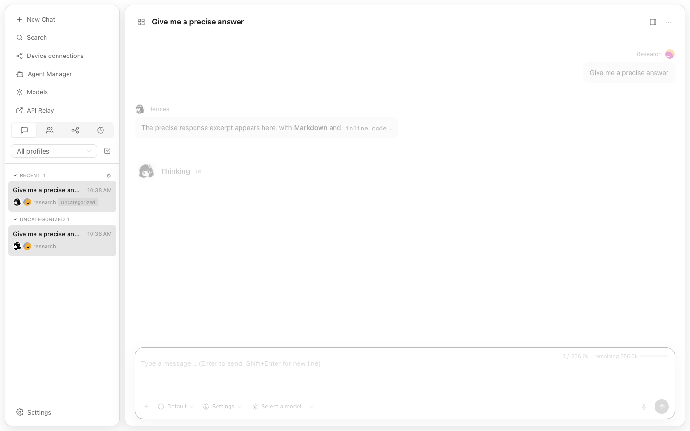

### 2. Select an exact excerpt

The user selects `precise response excerpt`. The floating toolbar exposes exactly one action: `Add to chat`. `Ask in side chat` and Side Chat UI are intentionally absent.

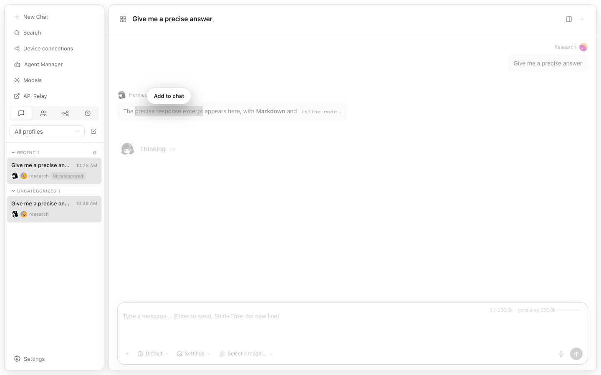

### 3. Open the annotation editor

After `Add to chat`, the editor shows the selected excerpt, an optional comment field, attachment control, Cancel, and Save.

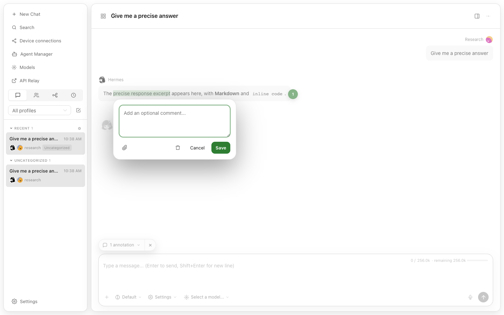

### 4. Enter a comment

The optional annotation comment is entered as `Why is this precise?`.

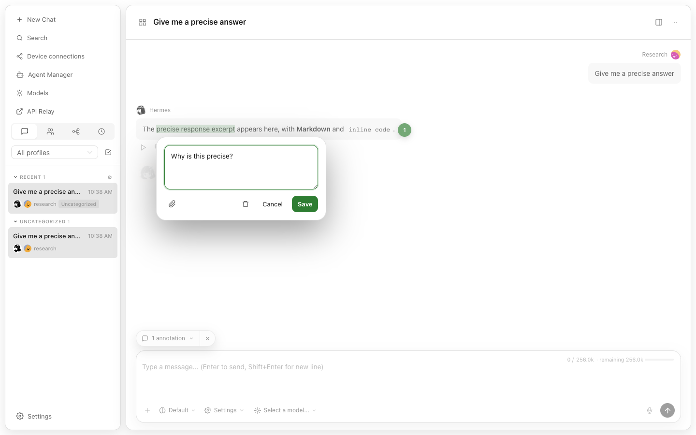

### 5. Save the annotation

The response now shows the green source highlight and marker `1`; the composer shows `1 annotation`.

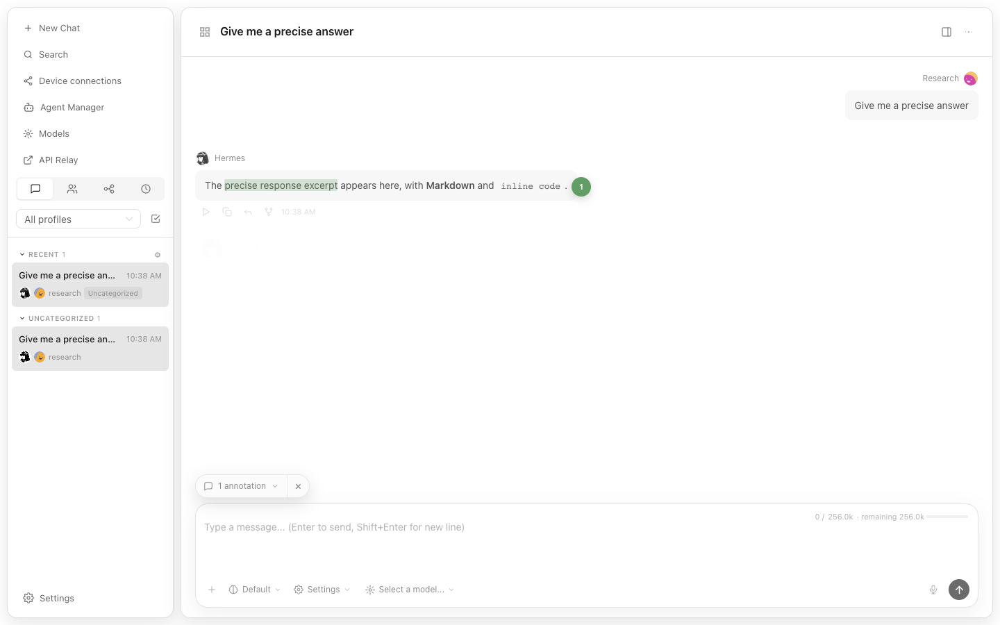

### 6. Preview the draft annotation

Hovering the composer chip opens a bounded preview with the selected excerpt and comment.

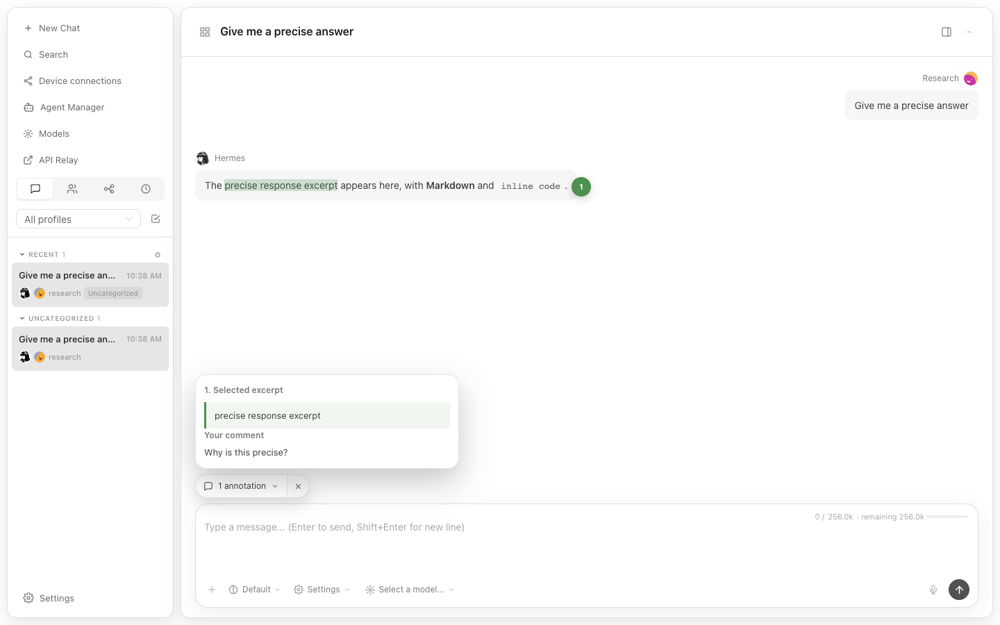

### 7. Expand annotation details

Clicking the composer chip expands the ordered annotation details.

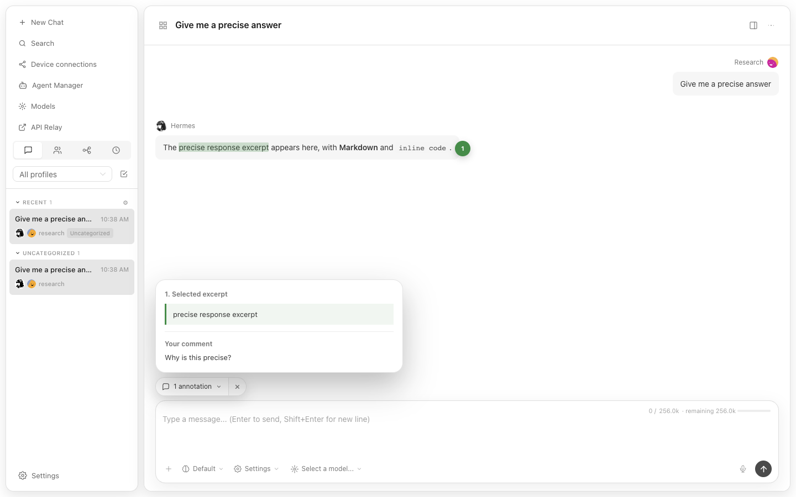

### 8. Send an annotation-only message

The user sends with no normal message text. The resulting user turn contains the annotation without an empty normal message bubble, and the composer draft is cleared after acceptance.

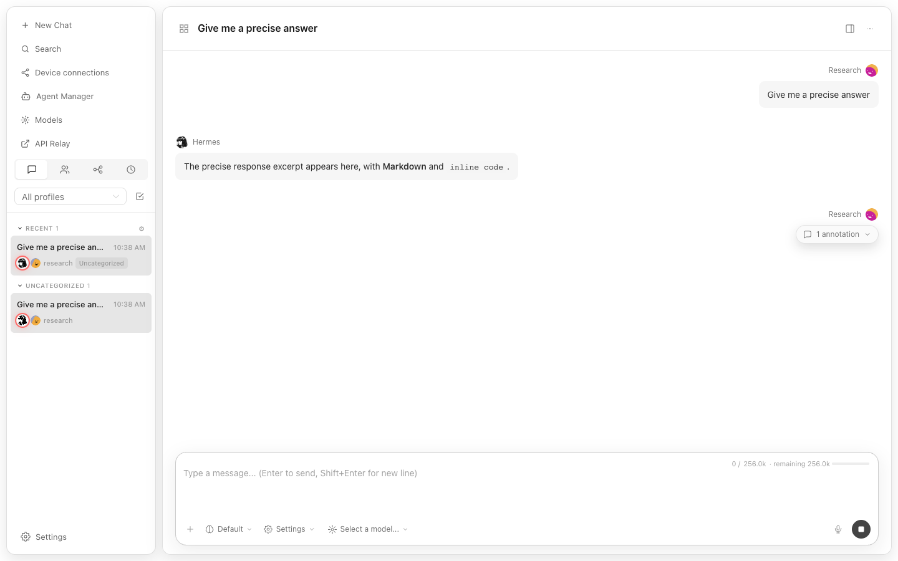

### 9. Open immutable sent evidence

The sent annotation evidence shows the selected excerpt, comment, and `Show source` action.

### 10. Restore the source

`Show source` restores and flashes the exact source range in the original Agent response while keeping sent evidence visible.

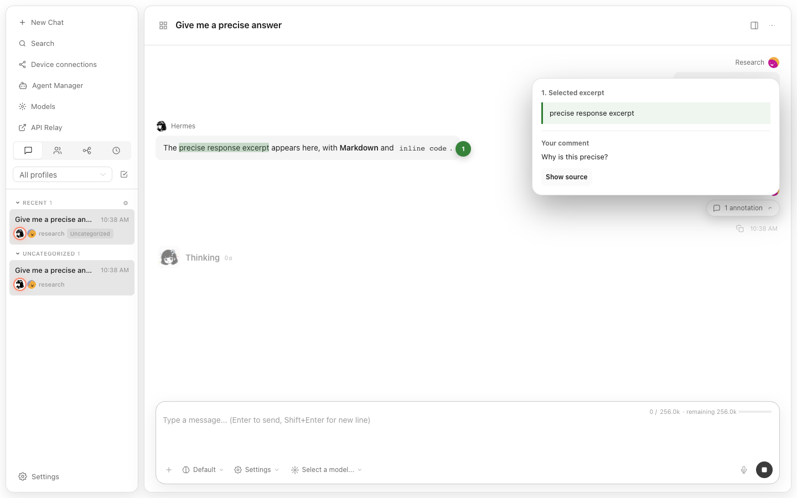

## Flow B — annotation plus an ordinary chat message

### 11. Draft both annotation and normal message

The saved annotation remains attached while the normal Chat input contains `Please explain how this excerpt supports the answer.`.

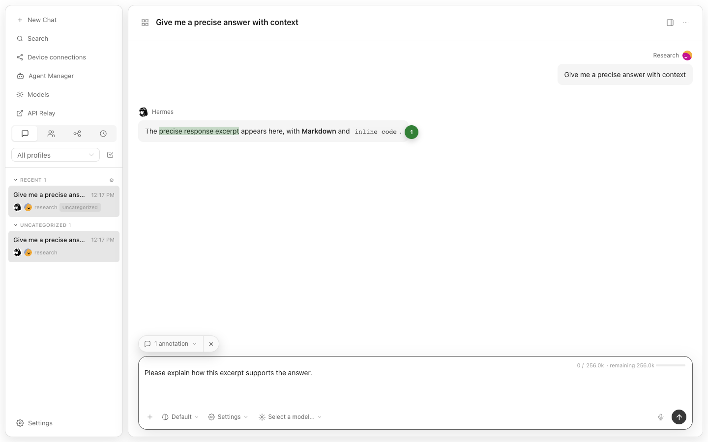

### 12. Send both in one user turn

The sent user turn contains a normal message bubble and `1 annotation` together. This is not annotation-only and no Side Chat is rendered.

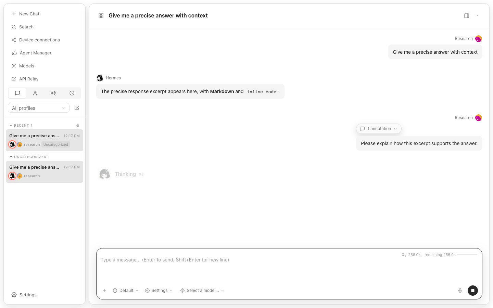

### 13. Inspect mixed sent evidence

The normal message remains visible while the annotation evidence card shows the selected excerpt, comment, and `Show source`.

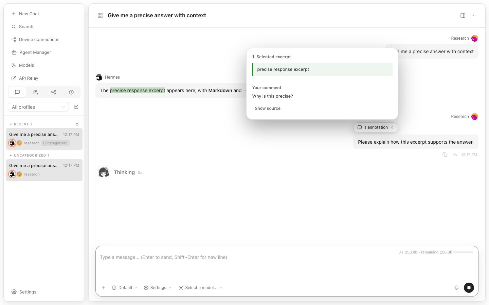

## Flow C — annotation-owned attachment plus an ordinary chat message

### 14. Add a file inside the annotation editor

The annotation editor contains the comment and the annotation-owned file `annotation-notes.txt` before Save. The file is not a generic composer attachment.

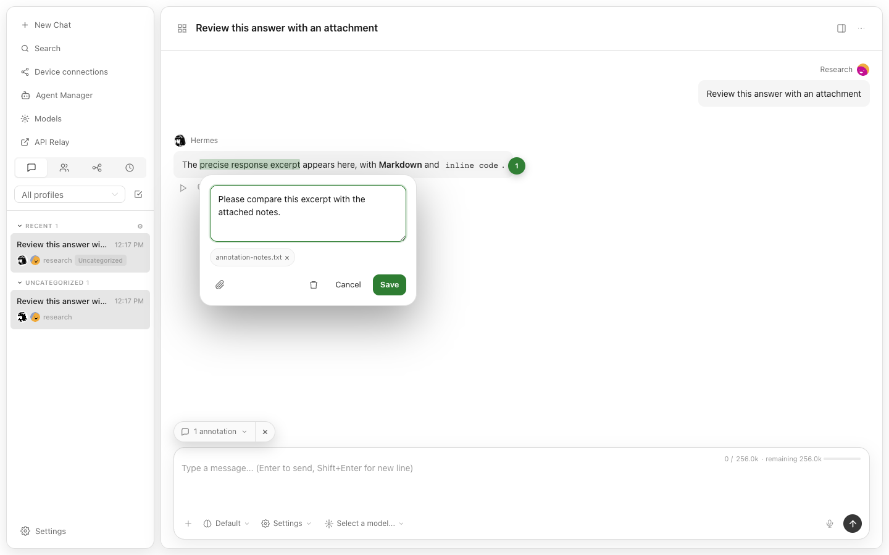

### 15. Draft attachment, annotation, and normal message

The expanded annotation details show the excerpt, comment, and `annotation-notes.txt`; the normal Chat input simultaneously contains `Please use the attached notes when answering.`.

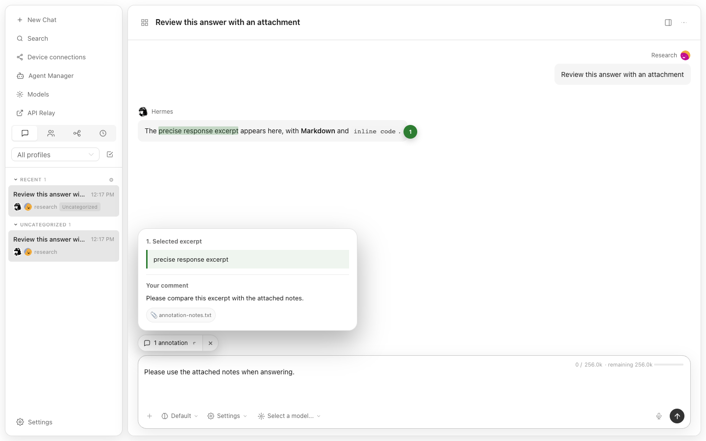

### 16. Send the combined message

The resulting user turn contains the ordinary message bubble and the annotation chip. The annotation-owned file remains associated with the annotation rather than being duplicated as a generic attachment.

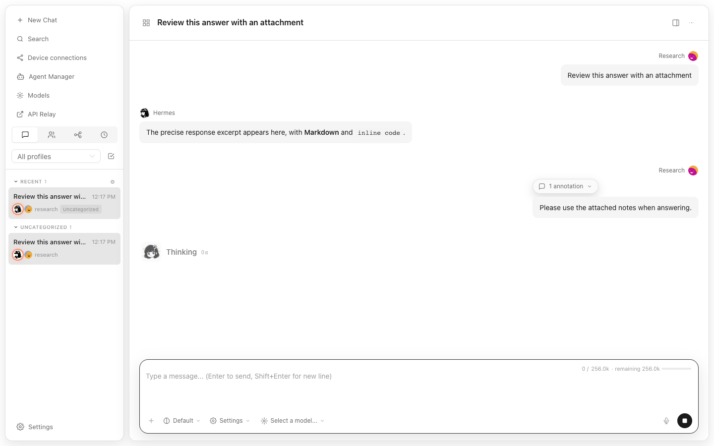

### 17. Inspect sent evidence with the attachment

The immutable evidence card shows the selected excerpt, comment, `annotation-notes.txt`, and `Show source`.

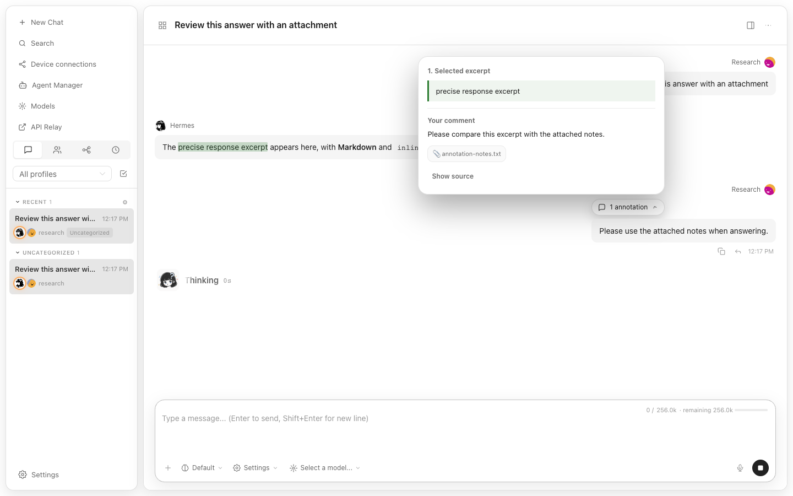

## Acceptance summary

- Exact rendered excerpt selection: verified.
- Only `Add to chat` action: verified.
- `Ask in side chat`: absent by design and verified absent.
- Optional comment: verified.
- Green highlight and ordered marker: verified.
- Annotation-only send: verified.
- Annotation plus ordinary message: verified.
- Annotation-owned attachment: verified.
- Immutable sent evidence: verified.
- `Show source`: verified.
- No blocking visual defect observed in the captured flows.
